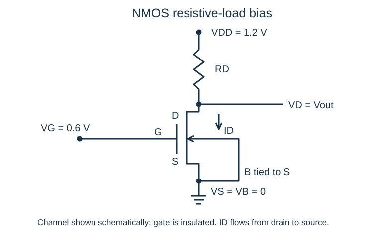

# L002 | MOS工作区、偏置与跨导

- 教材定位：本课是 COURSE.md 指定的**补充基础**，使用标准长沟道 MOS 模型与自编讲解；无对应教材小节、印刷页或 PDF 页，不虚构出处。
- 先修：L001。只需带来一个认识：收发机中的放大器必须把微小输入信号变成可用的输出。所需电路基础是欧姆定律与基尔霍夫电流定律。
- 学习量：约60分钟；建议目标与引入5分钟、物理过程10分钟、推导20分钟、例题20分钟、自查5分钟。课后题另计。
- 状态：2026-09-21 已生成并自查；掌握情况未评估。

## 1. 本课目标

学完后，你应能：

1. 根据 NMOS 的 VGS、VDS、VTH 判断截止、线性和饱和区，并用 VGD 解释饱和边界。
2. 从给定直流工作点求跨导 gm 与近似输出电阻 ro，说明两者分别是什么斜率。
3. 把器件方程与外部电阻约束联立，检验假设的工作区是否自洽。
4. 在说明“固定哪些条件”的前提下，解释过驱动电压、跨导、电流和功耗之间的取舍。

## 2. 从一个具体问题开始

假设接收机里有一级 NMOS 放大器：源极接地，漏极通过电阻 RD 接电源。我们想让栅极电压稍微增大时，漏极电流明显增大，再利用 RD 把电流变化转换成电压变化。

现在给出 VDD=1.2 V，目标漏极电流 ID=0.5 mA，过驱动电压 VOV=0.2 V。

- RD=1 kΩ，能实现这个工作点吗？
- 为了让电流变化产生更大电压变化，把 RD 改成2.2 kΩ，还能维持原工作点吗？

本课要建立的习惯是：**先求并检查直流工作点，再谈这个点附近如何放大。**

## 3. 物理过程与直觉

### 3.1 先把端口和方向说清楚

本课主要分析增强型 NMOS，漏极电压不低于源极，即 VDS≥0。电压均相对同一个参考地，常规电流 ID 定义为从漏极 D 流向源极 S；电子移动方向与此相反。

图为自绘端口示意，栅极与沟道绝缘；衬底 B 与源极 S 短接，右侧连线只表示 B、S 等电位。例题二取 VG=0.6 V、VTH=0.4 V；图中的固定栅压仅用于偏置分析。

定义：

\[
V_{GS}=V_G-V_S,\qquad V_{DS}=V_D-V_S,\qquad V_{GD}=V_G-V_D.
\]

**过驱动电压（overdrive voltage）**为

\[
\boxed{V_{OV}=V_{GS}-V_{TH}}.
\]

VGS 是栅源电压；VOV 是它超过阈值电压的部分，两者不能互换。本课中体源短接，先不考虑体效应（body effect），VTH 视作常数。

### 3.2 栅极控制沟道，漏源电压推动电流

栅极隔着氧化层，主要通过电场控制表面电子数量。VGS 超过阈值后，源漏之间形成反型沟道。VDS 产生沿沟道的电场，使电子从源端向漏端运动。

在理想静态模型中栅极没有直流电流，但放大器仍从电源取能；栅极还存在电容，电压变化时需要充放电。因此，“栅极不消耗直流电流”不等于“放大器不耗电”或“射频输入永远开路”。

### 3.3 为什么会出现饱和区？

设源端为零，沟道某处电位为 V(x)，当地维持反型的有效电压约为 VGS−VTH−V(x)。沿源到漏，V(x) 增大，反型电荷逐渐减少。

当漏端满足 VDS=VGS−VTH 时，漏端反型电荷在理想模型中降到零，形成**夹断（pinch-off）**边界。继续增加漏压，电流不会突然消失；载流子仍能穿过漏端高场区。长沟道理想模型中，电流主要由栅压决定，对漏压不再敏感。

“饱和”说的是电流对漏压的变化趋缓，并不是电流对栅压不变，也不是放大器输出已经削顶。

## 4. 建模与逐步推导

### 4.1 适用范围与记号

使用长沟道、强反型、准静态模型，忽略迁移率退化、速度饱和等短沟道效应；先令沟道长度调制为零，再单独引入。该模型用于建立物理关系，不能替代实际工艺器件模型。接近阈值或进入弱反型时，不应外推平方律。

定义

\[
k_n=\mu_n C_{ox}\frac WL,
\]

单位为 A/V²。这里 kn **不包含1/2**，以免不同教材记号造成两倍误差。

大写 ID、VGS、VDS 表示直流工作点；小写 vgs、vds、id 表示其上的增量。若出现正弦增量幅度，均指峰值；本课没有用 RMS、电压增益或功率增益替代跨导。

### 4.2 三个工作区

下表只用于上述 NMOS、VDS≥0 的模型。

| 工作区 | 判据 | 理想电流模型 |
|---|---|---|
| 截止（cutoff） | VGS≤VTH | ID≈0 |
| 线性/三极管区（triode） | VGS>VTH，0≤VDS<VOV | ID=kn[VOV VDS−VDS²/2] |
| 饱和（saturation） | VGS>VTH，VDS≥VOV | ID=kn VOV²/2 |

真实器件在阈值以下仍有亚阈值电流，表中的截止是手算近似。VDS=VOV 是边界，归入饱和判据不代表已有足够信号余量。

饱和条件也可以变形：

\[
V_D-V_S\ge V_G-V_S-V_{TH}
\quad\Longleftrightarrow\quad
\boxed{V_{GD}\le V_{TH}}.
\]

这表达的是：漏端的栅沟电压已不足以维持当地反型。注意仍需另行满足 VGS>VTH。

例如 VTH=0.4 V：

- VGS=0.3 V：近似截止。
- VGS=0.6 V、VDS=0.1 V：VOV=0.2 V，所以在线性区。
- VGS=0.6 V、VDS=0.7 V：在饱和区。

PMOS 若以电流大小和正的 VSG、VSD 表示，则导通条件是 VSG>|VTP|，饱和条件是 VSD≥VSG−|VTP|；不能直接把 NMOS 的正电压判据照搬。

### 4.3 平方律从哪里来？

采用渐变沟道近似，令 x 从源端0走向漏端L。反型层单位面积电荷的大小近似为

\[
|Q_i(x)|=C_{ox}[V_{OV}-V(x)].
\]

电流大小等于“单位长度电荷量”乘“漂移速度”，于是

\[
I_D=\mu_n W C_{ox}[V_{OV}-V(x)]\frac{dV}{dx}.
\]

稳态各截面电流相同。分离变量并积分：

\[
I_D\int_0^L dx
=\mu_n W C_{ox}\int_0^{V_{DS}}(V_{OV}-V)\,dV,
\]

\[
I_D L=\mu_n W C_{ox}\left(V_{OV}V_{DS}-\frac{V_{DS}^2}{2}\right).
\]

因此得到线性区方程。在夹断边界 VDS=VOV 处代入：

\[
I_D=k_n\left(V_{OV}^2-\frac{V_{OV}^2}{2}\right)
=\boxed{\frac12 k_nV_{OV}^2}.
\]

理想模型在饱和区保持这一电流。不能把线性区抛物线继续延伸到 VDS>VOV，否则会错误预测漏压越高，电流反而下降。

### 4.4 跨导是哪个方向的斜率？

**跨导（transconductance）**定义为工作点 Q 附近、保持漏源及体源电压不变时，漏极电流对栅源电压的偏导：

\[
g_m=\left.\frac{\partial I_D}{\partial V_{GS}}\right|_{Q,V_{DS},V_{BS}}.
\]

从平方律逐步求导：

\[
I_D=\frac12 k_n(V_{GS}-V_{TH})^2,
\]

\[
g_m=\frac12 k_n\cdot2(V_{GS}-V_{TH})\cdot1
=k_nV_{OV}.
\]

又因为 2ID=kn VOV²，所以

\[
\boxed{g_m=\frac{2I_D}{V_{OV}}=\sqrt{2k_nI_D}}.
\]

量纲 A/V=S（西门子），所以 gm 不是电压增益。若 gm=5 mS、vgs=1 mV，固定 vds=0 时，电流增量约为5 μA。

为什么强调“小”信号？展开同一个平方律：

\[
I_D(V_{GS}+v_{gs})
=I_D+g_mv_{gs}+\frac12 k_nv_{gs}^2.
\]

二次项相对一次项的绝对比值为 |vgs|/(2VOV)。VOV=0.2 V 时，10 mV 增量对应2.5%的项比值；100 mV 则对应25%。这不是通用失真指标，但说明局部切线近似为什么会随输入增大而变差。还必须保证信号全过程没有离开原工作区。

### 4.5 输出电阻从哪里来？

真实饱和区电流仍随漏压略增。**沟道长度调制（channel-length modulation）**可以用一阶经验修正表达：

\[
I_D=\frac12 k_nV_{OV}^2(1+\lambda V_{DS}),
\]

其中 λ 的单位是 V⁻¹，模型只用于饱和区附近的手算。固定 VGS、VBS，对 VDS 求导：

\[
g_{ds}=\frac{\partial I_D}{\partial V_{DS}}
=\lambda\frac12 k_nV_{OV}^2.
\]

**输出电阻（output resistance）**定义为该局部斜率的倒数：

\[
\boxed{r_o=\frac1{g_{ds}}=\frac{1+\lambda V_{DS}}{\lambda I_D}
\approx\frac1{\lambda I_D}}.
\]

最后一步需要 λVDS≪1。这里 ID 是含修正项的实际工作点电流。若用不含修正项的 I_D0=kn VOV²/2 表示，则 ro=1/(λI_D0) 在该模型内是精确关系。

同一修正模型下，固定 VDS 求栅压导数：

\[
g_m=k_nV_{OV}(1+\lambda V_{DS})=\frac{2I_D}{V_{OV}}.
\]

因此它仍满足 gm=2ID/VOV，但不能在保留调制项时同时无条件写 gm=kn VOV。

在同一工作点，两个方向的增量合起来：

\[
\boxed{i_d\approx g_mv_{gs}+\frac{v_{ds}}{r_o}}.
\]

ro 是晶体管内部电流特性的等效微分电阻；RD 是电路中实物负载电阻。ro 也不是静态比值 VDS/ID。

## 5. 公式说明与设计取舍

### 5.1 先问：改变 VOV 时，固定什么？

只说“VOV 越小，电流越小”或“gm 越大”都不完整。

| 保持不变的条件 | 降低 VOV 的结果 | 代价或限制 |
|---|---|---|
| 固定器件 kn | ID按VOV²下降，gm按VOV下降 | 电流省了，跨导也下降 |
| 固定 ID | gm=2ID/VOV增大 | kn必须增加，即通常要增大W/L；电容往往增大 |
| 固定目标 gm | ID=gm VOV/2下降 | kn=gm/VOV增大；需要改变尺寸，且强反型模型最终失效 |

固定 ID、L、工艺参数时，VOV 减半要求 W 增为4倍，gm 增为2倍；电容增长可能抵消高频性能收益。本课没有足够模型断言带宽一定如何变化。

单支路直流功耗是

\[
\boxed{P_{DC}=V_{DD}I_D}.
\]

固定 gm 和 VDD 时，较小 VOV 在平方律模型内可减少所需电流；固定尺寸时，较小 VOV 同时牺牲 gm。减小 VOV 还会减小饱和所需的最低 VDS，但对给定输入幅度，|vgs|/VOV 更大，线性近似更差。

### 5.2 三个极限检验

- VDS→0：线性区 ID→0，符合没有横向驱动电压就没有该模型中的净漏电流。
- λ→0：ro→∞，表示电流不受漏压增量影响；gm仍可非零，晶体管没有因此变成开路。
- VOV→0：平方律形式上给出 gm/ID=2/VOV→∞，但这已超出强反型模型适用范围，不能据此设计“零功耗、无限效率”的放大器。

## 6. 例题一：基本方法（自编）

**已知：**某 NMOS 已处于饱和区，ID=0.5 mA，VOV=0.2 V，λ=0.1 V⁻¹。求 gm、近似 ro；若漏源电压保持不变，栅源电压增加1 mV，电流约增加多少？

**解：**

\[
g_m=\frac{2(0.5\times10^{-3})}{0.2}
=0.005\ \mathrm{A/V}=\boxed{5\ \mathrm{mS}}.
\]

\[
r_o\approx\frac1{0.1\times0.5\times10^{-3}}
=\boxed{20\ \mathrm{k\Omega}}.
\]

\[
\Delta I_D\approx g_m\Delta V_{GS}
=5\ \mathrm{mS}\times1\ \mathrm{mV}=\boxed{5\ \mathrm{\mu A}}.
\]

单位复核：mS×mV=μA；(V⁻¹·A)⁻¹=Ω。1 mV 仅是 VOV 的0.5%，适合局部近似，前提仍是工作区不改变。

题目未给 VDS，因此不能算出含 (1+λVDS) 的更精确 ro，也不能独立验证饱和条件；“已在饱和区”是本题给定条件。若另外给 VDS=0.7 V，该经验模型给 ro=21.4 kΩ，说明20 kΩ是近似值。

## 7. 例题二：电阻增大后，原偏置还能成立吗？（自编）

**条件：**VDD=1.2 V，VS=VB=0，目标 ID=0.5 mA、VOV=0.2 V。检查 RD=1 kΩ 与2.2 kΩ 两种情况。

为了进一步求出第二种情况的实际电流，本题明确采用 **λ=0 的分段长沟道模型**，另取 VTH=0.4 V、固定 VG=0.6 V。这样 VOV=0.2 V。例题一的 λ 用于学习 ro，本题忽略它以集中分析工作区，两个近似层次不混用。

### 第一步：由外部电路写出负载约束

栅极无直流电流，RD 与漏极流过同一个 ID：

\[
V_D=V_{DD}-I_DR_D,\qquad V_{DS}=V_D\quad(V_S=0).
\]

目标电流与过驱动要求

\[
k_n=\frac{2I_D}{V_{OV}^2}
=\frac{0.001}{0.04}=0.025\ \mathrm{A/V^2}.
\]

### 第二步：RD=1 kΩ

先假设在饱和区，平方律给 ID=0.5 mA。

\[
V_{DS}=1.2-0.5\ \mathrm{mA}\times1\ \mathrm{k\Omega}
=\boxed{0.7\ \mathrm V}.
\]

因为0.7>0.2，假设自洽。饱和余量为 VDS−VOV=0.5 V。

支路功耗为1.2×0.5 mA=0.6 mW，其中晶体管消耗0.7×0.5 mA=0.35 mW，电阻消耗 ID²RD=0.25 mW，和为0.6 mW，能量关系一致。

### 第三步：RD=2.2 kΩ

若仍代入目标电流：

\[
V_{DS}=1.2-0.5\ \mathrm{mA}\times2.2\ \mathrm{k\Omega}
=0.1\ \mathrm V.
\]

0.1<0.2，违反饱和条件。因此**0.1 V只是用不成立假设得到的检查值，不是已经求出的真实工作点。**

在固定栅压条件下应改用线性区方程，与负载线联立。令 v=VDS，以伏为单位：

\[
\frac{1.2-v}{2200}=0.025\left(0.2v-\frac{v^2}{2}\right).
\]

整理得

\[
27.5v^2-12v+1.2=0.
\]

两根为0.155198 V和0.281165 V。线性区模型要求0≤v<0.2 V，故第二根必须舍去。有效解为

\[
\boxed{V_{DS}\approx0.1552\ \mathrm V},\qquad
\boxed{I_D=\frac{1.2-0.155198}{2200}\approx0.4749\ \mathrm{mA}}.
\]

把有效根回代线性区器件方程也得到0.4749 mA；它既满足电路方程，也满足所选工作区。此时不能继续套用饱和公式 gm=2ID/VOV；线性区固定漏压求导得到 gm=knVDS≈3.88 mS。

### 第四步：求电阻上限

保持目标 ID=0.5 mA 和 VOV=0.2 V，要在饱和区需

\[
V_{DD}-I_DR_D\ge V_{OV},
\]

\[
\boxed{R_D\le\frac{V_{DD}-V_{OV}}{I_D}=2\ \mathrm{k\Omega}}.
\]

等号只是直流饱和边界，实际放大还要留信号余量。若输入使 VOV 同时变化，应检验瞬时条件 VDS(t)≥VOV(t)，不能只检查输出电压是否高于原来的0.2 V。

设计结论：增加 RD 让同样的电流变化产生更大电压变化，但也增大直流压降，压缩漏极电压余量。器件与外部电路必须共同决定工作点。

## 8. 常见误区

1. **只检查 VGS>VTH 就说饱和。**这只说明导通，还要检查 VDS≥VOV。
2. **认为夹断意味着断路。**饱和区仍有漏极电流，夹断只是漏端沟道状态发生变化。
3. **把 gm 当成 ID/VGS。**gm 是偏导。例如 ID=0.5 mA、VGS=0.6 V 时，ID/VGS=0.833 mS，并不是本例的5 mS。
4. **把 ro 当成 RD 或 VDS/ID。**例题一附加 VDS=0.7 V 后，VDS/ID=1.4 kΩ，而近似 ro=20 kΩ；一个是静态比值，一个是局部斜率倒数。
5. **用饱和公式算完就结束。**必须把解代回工作区判据；二次方程的代数根不一定是物理解。
6. **不说明固定条件就讨论 VOV 与功耗。**固定尺寸、固定电流和固定跨导会得到不同结论。

## 9. 课后练习

均为自编题。

**① 概念题。**有人说：“λ=0 时 ro=∞，所以漏源之间不流电，晶体管无法放大。”指出错误，并说明饱和与截止的区别。

**② 计算题。**一只已在饱和区的 NMOS，ID=0.25 mA、VOV=0.25 V、λ=0.08 V⁻¹。求 gm、近似 ro。在固定 VDS 且不改变工作区时，vgs=5 mV 对应多大的近似电流增量？再令 VS=0、VDD=1.2 V、RD=2 kΩ，检查该目标工作点的饱和条件。

**③ 分析题。**使用 λ=0 模型。VDD=1.2 V，目标 gm=5 mS，比较 VOV=0.2 V 和0.1 V 的两个设计；允许调整 W/L，固定 L、工艺参数，源极接地。分别求 ID、支路功耗、kn 以及饱和所允许的最大 RD。若统一选 RD=2.2 kΩ，哪个设计能实现目标饱和工作点？降低 VOV 有哪些代价？

### 提示

1. 分清直流值与对某一个电压的导数；ro 与 gm 对应不同方向的变化。
2. 先算 gm 和 ro，再通过电阻压降求 VDS。
3. 先用 ID=gmVOV/2，再用 kn=gm/VOV，最后核对负载约束。

### 练习解答（建议先独立作答）

**①** ro=∞ 表示固定栅压时，漏压微小变化不引起漏电流变化；并不表示直流电流为零。理想饱和区 ID=knVOV²/2 可以非零，gm=knVOV 也可以非零。截止在本课近似中是 VGS≤VTH、ID≈0，两者不能混同。

**②**

\[
g_m=\frac{2\times0.25\ \mathrm{mA}}{0.25\ \mathrm V}=2\ \mathrm{mS},
\qquad r_o\approx\frac1{0.08\times0.00025}=50\ \mathrm{k\Omega}.
\]

\[
\Delta I_D\approx2\ \mathrm{mS}\times5\ \mathrm{mV}=10\ \mathrm{\mu A}.
\]

VDS=1.2−0.25 mA×2 kΩ=0.7 V，高于 VOV=0.25 V，因此目标工作区自洽。λVDS=0.056，使用近似 ro 有相应模型近似；含修正项的 ro 为52.8 kΩ。小信号二次项与一次项之比为0.005/(2×0.25)=1%。

**③**

| 量 | VOV=0.2 V | VOV=0.1 V |
|---|---:|---:|
| ID=gmVOV/2 | 0.5 mA | 0.25 mA |
| PDC=VDDID | 0.6 mW | 0.3 mW |
| kn=gm/VOV | 0.025 A/V² | 0.050 A/V² |
| RD,max=(VDD−VOV)/ID | 2 kΩ | 4.4 kΩ |

当 RD=2.2 kΩ，第一个设计无法保持目标饱和工作点，见例题二；第二个设计 VDS=1.2−0.25 mA×2.2 kΩ=0.65 V，大于0.1 V，满足条件。

第二个设计需要 W 增为2倍，而非固定电流情形中的4倍，因为这里固定的是 gm。代价包括电容可能增大、相同输入幅度下平方律曲率的相对影响增加，以及继续减小 VOV 后强反型模型失效。不能只凭功耗减半就断言射频带宽、噪声和线性度全部改善。

## 10. 掌握检查与下一课

请尝试不用看答案完成以下四项：

1. 用“漏端的栅沟电压”解释为什么饱和判据是 VDS≥VGS−VTH。
2. 从平方律自己求导得到 gm，并说出求偏导时哪些电压保持不变。
3. 解释例题二为何不能把0.1 V直接当成真实漏压，以及为何舍弃0.281165 V的根。
4. 用一句话分别解释 gm、ro、RD，且不把任何两者混为一谈。

没有用户解答证据，掌握状态保持“未评估”。可以先提交第②道计算题的过程，再检查概念题。

下一课 L003 将把本课的局部关系 id≈gm vgs+vds/ro 画成小信号等效电路，练习测试源法，求实际端口的增益和输出电阻。必须带走的是：先定工作点，再用局部斜率建立增量模型。

## 11. 出处与自查

- 课程依据：COURSE.md 的 L002 条目；补充基础，无指定教材小节及双页码。以上推导、图示、例题与练习均为标准模型的自编讲解，未引用原书例题号或图号。
- 数值复核：用 Python 标准库独立复核例题一、例题二二次方程两根、有效根回代、工作区判据、练习答案和功率平衡；检查代码位于 L002/check_values.py。
- 模型自查：明确 λ=0 与含 λ 的模型层次；明确 ro 近似所用 ID；检查线性区根的适用范围。未进行晶体管级或工艺仿真。
- 图文自查：图中漏极经 RD 接电源，源体接地，栅极绝缘；ID方向为漏到源。SVG 为自绘示意，不是原书电路图。

## 用户笔记与作业

尚未收到本课笔记或作业。
