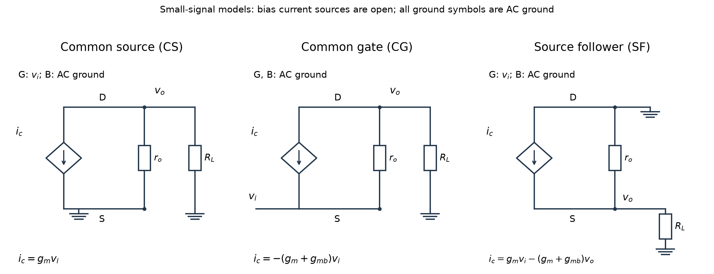

# L004 | 共源、共栅与源跟随器

- 教材定位：本课是 COURSE.md 指定的**补充基础**，使用标准 MOS 小信号模型；教材小节、印刷页、PDF 页均不适用，不虚构原书出处。
- 先修：L003 的小信号模型、交流地、KCL 与测试源法。下文先补齐必要知识。
- 学习量：约 60 分钟，先修与问题 5 分钟、物理解释 10 分钟、推导 20 分钟、例题 20 分钟、检查 5 分钟；练习另计。
- 状态：2026-09-21 已生成；掌握情况未评估。
- 公式格式：行内使用 `$...$`，独立公式使用 `$$...$$`，不将数学公式放入代码块。阅读器需支持 LaTeX 数学渲染。

## 1. 本课目标

1. 从同一个 MOS 小信号模型列 KCL，推导三种基本级的低频电压增益。
2. 用测试源说明三种级的输入、输出电阻，并指出近似条件。
3. 区分输入端电压与信号源开路电压，计算包含源内阻的总传输。
4. 根据源内阻、负载与体效应选择结构，解释所付出的代价。

先修补齐：晶体管先在饱和区建立直流工作点，再分析附近的小变化。栅极变化控制电流，漏源电压变化也会影响电流：

$$
i_d=g_m v_{gs}+g_{mb}v_{bs}+g_o v_{ds},\qquad g_o=\frac{1}{r_o}.
$$

$i_d$ 的正方向为漏极 D 指向源极 S；$g_m$ 是跨导（transconductance），$g_{mb}$ 是体跨导，单位均为西门子 S；$r_o$ 是器件输出电阻，单位为欧姆。三个控制电压都按下标前者减后者定义。

若体端与源极相连，体源小信号电压为零，体效应项消失。**忽略沟道长度调制意味着输出电阻趋于无穷大，不是把它短路。**

## 2. 从一个具体问题开始

同一只 NMOS，跨导为 $10\,\mathrm{mS}$，要驱动 $1\,\mathrm{k\Omega}$ 负载。把信号送入栅极、从漏极取出；送入源极、从漏极取出；或者送入栅极、从源极取出，分别会怎样？

我们将得到：在忽略体效应和有限输出电阻时，三种**输入端到输出端**的增益依次为

$$
A_{v,\mathrm{CS}}=-10,\qquad
A_{v,\mathrm{CG}}=+10,\qquad
A_{v,\mathrm{SF}}=\frac{10}{11}\approx0.909.
$$

但这还不能决定接到真实信号源后的输出大小：共栅级会明显加载信号源。源内阻足够大时，其端口增益仍为 10，总传输却可能小于 1。这是本课最重要的区分。

## 3. 物理过程与直觉

“共”指某个端子是输入、输出共同的**交流参考端**，不要求它的直流电压为零。

| 结构 | 输入 | 输出 | 交流固定端 | 首先记住的物理过程 |
|---|---|---|---|---|
| 共源 CS，common source | 栅极 | 漏极 | 源极 | 栅压升高，漏电流增大，漏压下降 |
| 共栅 CG，common gate | 源极 | 漏极 | 栅极 | 源压升高，栅源电压减小，漏电流减小，漏压升高 |
| 源跟随器 SF，source follower，也称共漏 CD | 栅极 | 源极 | 漏极 | 栅压升高，电流先增大，源压随之升高，抵消部分栅源电压变化 |

共源级和共栅级都可以把电流变化转换成较大的输出电压变化。源跟随器依靠源极运动形成局部负反馈，电压增益通常不到 1，但可以改善驱动能力。

“驱动能力”在这里指输出电阻较低，接负载后电压下降较少。负载获得的能量来自直流电源，不能因为栅极几乎不取电流就认为电路不需要供能。

## 4. 建模与逐步推导

### 4.1 统一电路、工作点与端口约定

本课使用 NMOS，体端固定接交流地，先保留体效应；需要忽略时再令体跨导为零。三个电路均已建立饱和区工作点，具有足够电源余量；输入很小，不跨越截止、三极区或偏置源的工作边界。

为公平比较，三个级在各自偏置下采用相同的小信号参数，不要求直流节点电压相同。具体偏置连接为：

- 共源：源极固定，漏极由理想偏置电流源供电，栅极施加直流偏置及小信号。
- 共栅：栅极由理想偏置电压固定，源极有直流偏置通路并叠加输入，漏极由理想偏置电流源供电。
- 源跟随器：漏极接理想电源，源极由理想电流源下拉偏置，栅极施加偏置及输入。

理想偏置电流源在小信号模型中开路。负载 $R_L$ 通过隔直耦合接输出，因此不改变直流工作点。实际偏置电阻或电流源的有限输出电阻需要另行加入，不能凭空忽略。

本课所谓“低频增益”，准确地说是**耦合电容已近似短路、寄生电容尚可忽略的中频增益**，不是隔直电路在零频率下的传输。忽略栅漏电、栅偏置网络的交流加载和器件电容。

统一定义：

$$
A_v=\frac{v_o}{v_i},\qquad
A_{\mathrm{tot}}=\frac{v_o}{v_{\mathrm{sig}}}.
$$

$v_i$ 是实际输入端电压；$v_{\mathrm{sig}}$ 是戴维南信号源的开路电压，源串联电阻记作 $R_{\mathrm{sig}}$。两者均对同一交流地测量。所有信号均为单端小信号；正弦幅值使用峰值，增益为电压增益，单位 V/V，不是功率增益。

下图为自绘小信号等效电路。菱形电流源方向统一为 D→S，标注的 $i_c$ 仅包括跨导项；器件输出电阻单独画出。栅极是控制端，不与漏源支路导电连接。

### 4.2 共源级：为什么反相？

源极和体端均为交流地，所以

$$
v_{gs}=v_i,\qquad v_{bs}=0,\qquad v_{ds}=v_o.
$$

漏极处把“从节点流出的电流”取为正，KCL 为

$$
\frac{v_o}{R_L}+\frac{v_o}{r_o}+g_m v_i=0.
$$

移项并提出输出电压：

$$
v_o\left(\frac{1}{R_L}+\frac{1}{r_o}\right)=-g_m v_i.
$$

因此

$$
\boxed{A_{v,\mathrm{CS}}=-g_m(R_L\parallel r_o)}.
$$

符号 $\parallel$ 表示并联。若器件输出电阻远大于负载：

$$
A_{v,\mathrm{CS}}\approx-g_mR_L.
$$

正输入使向下的电流增加，漏极必须降低电压，让负载提供补充电流，因此输出为负。

栅极不取电流，所以本模型下

$$
R_{\mathrm{in,CS}}\rightarrow\infty.
$$

求输出电阻时，移除负载，将独立输入源置零，保留受控源。栅、源小信号均为零，受控源的数值才随之为零；输出测试电流只经过器件输出电阻：

$$
R_{\mathrm{out,CS}}=r_o.
$$

如果实际漏极另有接向电源的电阻 $R_D$，增益中的等效电阻应为三者并联，放大器输出电阻则为

$$
R_{\mathrm{out,CS}}=r_o\parallel R_D.
$$

外接负载不包含在“放大器本身的输出电阻”中。

### 4.3 共栅级：正增益与低输入电阻

栅极、体端固定，源极输入，因此

$$
v_{gs}=-v_i,\qquad v_{bs}=-v_i,\qquad v_{ds}=v_o-v_i.
$$

为简化书写，定义一个总跨导：

$$
g=g_m+g_{mb}.
$$

这里源压上升既减小栅源电压，也使体源电压更负，两种作用都使漏电流减小：

$$
i_d=-g v_i+g_o(v_o-v_i).
$$

漏极 KCL 为

$$
\frac{v_o}{R_L}-g v_i+g_o(v_o-v_i)=0.
$$

整理得到

$$
\boxed{A_{v,\mathrm{CG}}=
\frac{g+g_o}{1/R_L+g_o}
=\frac{(1+g r_o)R_L}{r_o+R_L}}.
$$

当器件输出电阻趋于无穷大：

$$
A_{v,\mathrm{CG}}\approx(g_m+g_{mb})R_L.
$$

再忽略体效应，就得到常见的正增益表达式：

$$
A_{v,\mathrm{CG}}\approx g_mR_L.
$$

**输入电流从哪里来？** 输入接在源极，源极不是绝缘栅。定义 $i_i$ 为信号源注入源极的电流。只有漏源支路导电，因此

$$
i_i=-i_d=\frac{v_o}{R_L}.
$$

于是输入电阻为

$$
\boxed{R_{\mathrm{in,CG}}
=\frac{v_i}{i_i}
=\frac{R_L}{A_{v,\mathrm{CG}}}
=\frac{r_o+R_L}{1+g r_o}}.
$$

若同时满足

$$
r_o\gg R_L,\qquad g r_o\gg1,
$$

则

$$
R_{\mathrm{in,CG}}\approx\frac{1}{g_m+g_{mb}}.
$$

忽略体效应且跨导为 $10\,\mathrm{mS}$ 时，输入电阻约为 $100\,\Omega$。这正是共栅级容易加载信号源的原因。

输出电阻也必须说明输入如何终止。把信号源置零后，源极通过 $R_{\mathrm{sig}}$ 接地。移除输出负载，在漏极注入测试电流 $i_x$；该电流最终经源电阻回地：

$$
v_s=i_xR_{\mathrm{sig}},\qquad
i_x=-g v_s+\frac{v_x-v_s}{r_o}.
$$

代入并整理：

$$
\boxed{R_{\mathrm{out,CG}}
=\frac{v_x}{i_x}
=r_o+(1+g r_o)R_{\mathrm{sig}}}.
$$

输入由理想电压源固定时，源电阻为零，结果退回器件输出电阻。源电阻增加会产生反馈，使漏端输出电阻提高；不能把共栅级的输出电阻也误记成跨导的倒数。

### 4.4 源跟随器：为什么跟得上，又跟不满？

漏极、体端为交流地，栅极输入，源极输出：

$$
v_{gs}=v_i-v_o,\qquad v_{bs}=-v_o,\qquad v_{ds}=-v_o.
$$

从漏极流向源极的电流为

$$
i_d=g_m(v_i-v_o)-g_{mb}v_o-g_o v_o.
$$

该电流供给源极负载，故

$$
\frac{v_o}{R_L}
=g_m(v_i-v_o)-g_{mb}v_o-g_o v_o.
$$

把输出相关项移到左侧：

$$
\left(g_m+g_{mb}+g_o+\frac{1}{R_L}\right)v_o=g_m v_i.
$$

因此

$$
\boxed{A_{v,\mathrm{SF}}
=\frac{g_m}{g_m+g_{mb}+g_o+1/R_L}}.
$$

忽略体效应和有限输出电阻：

$$
\boxed{A_{v,\mathrm{SF}}\approx\frac{g_mR_L}{1+g_mR_L}}.
$$

输出升高会减小栅源电压变化，抑制电流继续增加。因此它与输入同向，但增量通常比输入小。这里的小信号“跟随”也不意味着直流栅、源电压相等；直流仍需要栅源偏置压差。

栅极不取电流，故输入电阻趋于无穷大。求输出电阻时，移除负载，输入置零，源极加测试电压 $v_x$。测试源送入电路的电流为

$$
i_x=(g_m+g_{mb}+g_o)v_x.
$$

所以

$$
\boxed{R_{\mathrm{out,SF}}=
\frac{1}{g_m+g_{mb}+g_o}\approx\frac{1}{g_m}}.
$$

最后一个近似要求体跨导和输出电导相对栅跨导都很小。注意：体效应会降低输出电阻，却也降低电压增益，不能只看其中一项。

### 4.5 把信号源接回来

由输入分压：

$$
v_i=v_{\mathrm{sig}}\frac{R_{\mathrm{in}}}{R_{\mathrm{sig}}+R_{\mathrm{in}}}.
$$

因此

$$
\boxed{A_{\mathrm{tot}}=A_v
\frac{R_{\mathrm{in}}}{R_{\mathrm{sig}}+R_{\mathrm{in}}}}.
$$

共源和源跟随器在本模型中不取栅电流，所以源内阻没有造成输入分压。但加入有限栅偏置电阻或寄生电容后，就不能照搬这个结论。

共栅级代入精确结果，得到

$$
\boxed{A_{\mathrm{tot,CG}}=
\frac{(1+g r_o)R_L}
{r_o+R_L+(1+g r_o)R_{\mathrm{sig}}}}.
$$

忽略有限输出电阻时：

$$
\boxed{A_{\mathrm{tot,CG}}\approx
\frac{gR_L}{1+gR_{\mathrm{sig}}}
=\frac{R_L}{R_{\mathrm{sig}}+1/g}}.
$$

分子是级内放大，分母包含信号源受到的加载。只算分子，会高估真实输出。

## 5. 公式说明与设计取舍

下表仅适用于忽略体效应、栅电流和器件电容，且输出电阻足够大的情况；共栅输入由理想电压源固定时，其输出电阻为器件输出电阻。

| 结构 | 端口电压增益 | 输入电阻 | 输出电阻的特点 | 合适的任务 |
|---|---|---|---|---|
| 共源 | $-g_mR_L$ | 很高 | 高 | 需要反相电压放大 |
| 共栅 | $+g_mR_L$ | 约 $1/g_m$ | 高，并受源端终止影响 | 接受较低源阻抗输入、需要同相放大 |
| 源跟随器 | $g_mR_L/(1+g_mR_L)$ | 很高 | 约 $1/g_m$ | 隔离前级与负载，提供缓冲 |

量纲检查：跨导乘电阻为无量纲，所以能表示电压增益；跨导的倒数为欧姆，所以能表示电阻。

几个边界尤其有用：

1. 负载趋于短路时，三个级的电压增益都趋于零。输出端被短路，不能维持有限输出电压。
2. 对共源级，负载很大而器件输出电阻有限时，增益幅度趋于器件本征增益 $g_mr_o$，不会无限增加。
3. 对共栅级，负载很大时，精确输入电阻也会增大。低输入电阻近似需要前述条件，不能对任意漏端负载都使用。
4. 无体效应、输出电阻无限大时，源跟随器的空载增益趋于 1；有体效应时，即便忽略输出电导，其极限也只是

$$
A_{v,\mathrm{SF,max}}=\frac{g_m}{g_m+g_{mb}}.
$$

5. 共栅级在较大源内阻下，继续增加跨导的收益变小：

$$
gR_{\mathrm{sig}}\gg1
\quad\Longrightarrow\quad
A_{\mathrm{tot,CG}}\approx\frac{R_L}{R_{\mathrm{sig}}}.
$$

提高跨导的设计代价：固定尺寸下，通常需要更多偏置电流；固定电流下，通过增大尺寸提高跨导，通常会增大寄生电容。本课尚未分析带宽、噪声、失真，不能仅凭这张低频表宣布某结构在射频设计中“最好”。

## 6. 例题一：同样的晶体管，三种连接（自编）

**题目。** 三种级均有

$$
g_m=10\,\mathrm{mS},\qquad R_L=1\,\mathrm{k\Omega}.
$$

忽略体效应与沟道长度调制。信号源理想，开路信号峰值为 $1\,\mathrm{mV}$。求端口增益、输出峰值和极性，并比较阻抗。

这里“开路输入”指信号源的开路电压，不是把输出负载拿掉。由于源内阻为零，实际输入电压等于开路电压。

**解答。** 先统一单位：

$$
g_mR_L=(0.010\,\mathrm{S})(1000\,\Omega)=10.
$$

共源级：

$$
A_v=-10,\qquad v_o=-10v_i.
$$

输出峰值为 $10\,\mathrm{mV}$，反相。

共栅级：

$$
A_v=+10,\qquad v_o=10v_i,\qquad
R_{\mathrm{in}}=\frac{1}{0.010}=100\,\Omega.
$$

输出峰值为 $10\,\mathrm{mV}$，同相。输入电流峰值为

$$
I_{i,\mathrm{pk}}=\frac{1\,\mathrm{mV}}{100\,\Omega}=10\,\mathrm{\mu A}.
$$

负载电流峰值也是 $10\,\mathrm{\mu A}$，与源、漏电流连续性一致。

源跟随器：

$$
A_v=\frac{10}{11}\approx0.9091.
$$

输出峰值为 $0.9091\,\mathrm{mV}$，同相。它的输出电阻为

$$
R_{\mathrm{out}}=\frac{1}{g_m}=100\,\Omega.
$$

也可用空载增益为 1 的戴维南模型核验：

$$
\frac{R_L}{R_L+R_{\mathrm{out}}}
=\frac{1000}{1000+100}=0.9091.
$$

共源与源跟随器的输入电阻均趋于无穷大；在本题理想化条件下，共源与共栅的输出电阻均趋于无穷大。后者不意味着加载后输出无限大，因为仍有有限负载。

**结果含义：** 共源、共栅都能放大电压，但从输入端取用信号电流的方式不同。源跟随器电压增益不到 1，却能把高输入电阻和较低输出电阻组合起来。

## 7. 例题二：源内阻从低到高，再加入体效应（自编）

**题目。** 延续例题一，信号源开路峰值仍为 $1\,\mathrm{mV}$，源内阻分别为 $50\,\Omega$ 和 $10\,\mathrm{k\Omega}$。先忽略体效应，再令体端固定且体跨导为 $2\,\mathrm{mS}$。比较总传输；器件输出电阻仍视为无限大。

### 第一步：无体效应

共源和源跟随器不取输入电流，因此总增益分别仍为

$$
A_{\mathrm{tot,CS}}=-10,\qquad
A_{\mathrm{tot,SF}}=0.9091.
$$

共栅输入电阻为 $100\,\Omega$。源内阻为 $50\,\Omega$ 时：

$$
\frac{v_i}{v_{\mathrm{sig}}}=\frac{100}{50+100}=\frac{2}{3},
$$

$$
A_{\mathrm{tot,CG}}=10\times\frac{2}{3}=6.6667.
$$

输出峰值为 $6.6667\,\mathrm{mV}$。

源内阻为 $10\,\mathrm{k\Omega}$ 时：

$$
\frac{v_i}{v_{\mathrm{sig}}}=\frac{100}{10000+100}=\frac{1}{101},
$$

$$
A_{\mathrm{tot,CG}}=\frac{10}{101}\approx0.09901.
$$

实际输入峰值只有 $9.901\,\mathrm{\mu V}$，输出峰值为 $99.01\,\mathrm{\mu V}$。**端口增益仍为 10，总增益却不足 0.1。**

### 第二步：加入体效应

共源级的源、体均固定，体源小信号电压仍为零，所以在给定跨导不变的前提下，本题结果不变。

共栅级的总跨导变为

$$
g=g_m+g_{mb}=12\,\mathrm{mS}.
$$

于是

$$
A_{v,\mathrm{CG}}=12,\qquad
R_{\mathrm{in,CG}}=\frac{1}{0.012}\approx83.33\,\Omega.
$$

源内阻为 $50\,\Omega$ 时：

$$
A_{\mathrm{tot,CG}}=\frac{12}{1+0.012\times50}=7.5.
$$

源内阻为 $10\,\mathrm{k\Omega}$ 时：

$$
A_{\mathrm{tot,CG}}=\frac{12}{1+0.012\times10000}
=\frac{12}{121}\approx0.09917.
$$

端口增益提高了，但输入电阻降低、加载加重，所以高源内阻下总传输几乎没有改善。

源跟随器的增益为

$$
A_{v,\mathrm{SF}}=\frac{10}{10+2+1}=\frac{10}{13}\approx0.7692.
$$

上式分子、分母均以 mS 计，负载电导为 $1\,\mathrm{mS}$。体效应使增益降低，其物理原因是源压上升引起反向体偏置增加，抑制漏电流。

| 条件 | 共源总增益 | 共栅总增益 | 源跟随器总增益 |
|---|---|---|---|
| 无体效应，源内阻 $50\,\Omega$ | $-10$ | $6.6667$ | $0.9091$ |
| 无体效应，源内阻 $10\,\mathrm{k\Omega}$ | $-10$ | $0.09901$ | $0.9091$ |
| 有体效应，源内阻 $50\,\Omega$ | $-10$ | $7.5$ | $0.7692$ |
| 有体效应，源内阻 $10\,\mathrm{k\Omega}$ | $-10$ | $0.09917$ | $0.7692$ |

**设计判断：** 对高内阻电压源，若需要电压放大，可考虑共源；若希望电压同相、接近原值并降低输出电阻，可考虑源跟随器。共栅的低输入电阻可能适合某些低阻源接口，但仅有低阻并不等于已经实现指定阻抗匹配，仍需比较实际阻值。

## 8. 常见误区

1. **“忽略输出电阻”就是令它为零。** 正确处理是支路开路；短路会直接改变拓扑。
2. **共栅的 MOS 栅极不取电流，所以共栅输入电阻无限大。** 共栅输入接的是源极，不是栅极。
3. **源跟随器增益一定等于 1。** 例题一有负载时只有约 0.909；例题二加入体效应后只有约 0.769。
4. **总增益就是端口增益。** 共栅在例题二的高源内阻条件下，一个是 10，另一个约为 0.099。
5. **体效应总会减小电压增益。** 它减小源跟随器增益，却会提高给定输入端电压下的共栅增益；必须看控制电压如何变化。
6. **低频栅输入电阻高，任意频率都不加载前级。** 高频时栅电容会取交流电流，本课模型不包含这种效应。
7. **计算输出电阻时删除受控源。** 应先将独立源置零；受控源是否为零由控制量决定，共栅和跟随器中通常不能删除。

## 9. 课后练习

以下均为自编题，继续使用本课偏置、负载隔直及低频模型。

### 题 1：概念

有人说：“共栅管的栅极固定，因此它不可能放大；源跟随器电压增益不到 1，因此没有用途。”分别用电压、电流的变化过程反驳，并说明共栅为什么会加载信号源。

### 题 2：计算

令跨导为 $5\,\mathrm{mS}$，负载为 $2\,\mathrm{k\Omega}$，忽略体效应及有限输出电阻。信号源内阻为 $200\,\Omega$，开路峰值为 $2\,\mathrm{mV}$。

求三个级的端口增益、总增益、输出峰值；再求共栅的输入电阻和跟随器的输出电阻。

### 题 3：分析

用源跟随器缓冲高内阻信号源。负载为 $1\,\mathrm{k\Omega}$，忽略有限输出电阻；要求电压增益至少为 0.90。假定可用器件在比较范围内满足

$$
g_{mb}=0.2g_m.
$$

能否仅增加跨导来满足要求？若工艺允许体源相连、从而消除体效应，最低跨导是多少？说明实际实现还要付出什么代价。

### 提示

- 题 1：电流由栅源电压控制；固定栅压并不等于固定栅源电压。
- 题 2：先算每个级的输入电阻，再判断源内阻是否引入分压。
- 题 3：先看无限大跨导的增益极限，再解不等式；不要直接套用无体效应公式。

### 独立答案

**题 1。** 共栅输入使源压变化，栅压虽固定，栅源电压仍变化；正向源压增量使漏电流减小，漏压上升，形成同相增益。源极属于导电通路，因此输入信号必须提供电流，输入电阻有限。源跟随器可以用很高的输入电阻减轻前级负担，再用较低的输出电阻驱动负载；电压增益不到 1 不妨碍缓冲作用。

**题 2。** 共同的无量纲乘积为

$$
g_mR_L=0.005\times2000=10.
$$

共源：

$$
A_v=A_{\mathrm{tot}}=-10,\qquad V_{o,\mathrm{pk}}=20\,\mathrm{mV}.
$$

输出反相。共栅输入电阻为

$$
R_{\mathrm{in}}=\frac{1}{0.005}=200\,\Omega.
$$

恰好与源电阻相等，因此输入电压是源开路电压的一半：

$$
A_v=10,\qquad
A_{\mathrm{tot}}=10\frac{200}{200+200}=5.
$$

输出峰值为 $10\,\mathrm{mV}$，同相。源跟随器：

$$
A_v=A_{\mathrm{tot}}=\frac{10}{11}\approx0.9091,
$$

$$
V_{o,\mathrm{pk}}=\frac{10}{11}\times2\,\mathrm{mV}
\approx1.818\,\mathrm{mV},\qquad
R_{\mathrm{out}}=200\,\Omega.
$$

**题 3。** 保留体效应时：

$$
A_v=\frac{g_m}{1.2g_m+1/R_L}.
$$

即使跨导无限大，也只能逼近

$$
\lim_{g_m\to\infty}A_v=\frac{1}{1.2}\approx0.8333<0.90.
$$

所以仅增加跨导不能达到目标。若允许体源相连：

$$
\frac{g_mR_L}{1+g_mR_L}\ge0.90.
$$

分母为正，交叉相乘：

$$
g_mR_L\ge0.90+0.90g_mR_L,
$$

$$
0.10g_mR_L\ge0.90
\quad\Longrightarrow\quad
g_m\ge\frac{9}{R_L}=9\,\mathrm{mS}.
$$

这是理想模型下的下限。实际还需考虑偏置源输出电阻、器件输出电阻与电源余量；提高跨导可能增加功耗或器件电容。体源相连要求工艺和隔离结构允许，不能把共享衬底任意接到某个变化的源极。

## 10. 掌握检查与下一课

合上推导，检查自己能否完成以下任务：

1. 对三种结构分别写出栅源、体源、漏源小信号电压，并从 KCL 推出增益。
2. 解释共栅输入电阻为何较低，而输出电阻通常较高。
3. 在例题二中解释：为什么源内阻增大后，共栅端口增益不变，但总传输明显下降？
4. 解释题 3 中为什么增加跨导无法突破体效应设定的增益上限。

能复述结论还不等于已经能独立计算。本课掌握情况保持“未评估”，待你的推导、计算或解释作为证据。

下一课 L005 讲差分对、半电路与共源共栅。需要带走两件事：共源将输入电压变成漏电流；共栅可以接收源极电流，并通过输入端约束影响前级的漏端变化。

## 11. 出处与自查

- 范围依据：COURSE.md 的 L004 条目与 sources/TEXTBOOK_MAP.md 对 L002–L008 补充基础的说明。全部例题、练习和电路图均为自编，不引用未核实的教材图号、题号或页码。
- 已复核：三种电路的 KCL 符号、加载与空载定义、有限输出电阻条件、体效应方向、例题和练习关键数值、公式量纲及极限。
- `L004/draw_and_check.py` 用线性节点方程独立核对共栅的输入电阻、总增益和输出测试源结果，以及跟随器 KCL，并生成可复核的 SVG 和 PNG 电路图。该检查是线性模型核算，不是晶体管级或工艺仿真；本课没有另设数值实验。
- 本讲义全部公式使用美元符号数学定界，正文不混用其他数学定界形式。

## 用户笔记与作业

尚未收到本课用户笔记或作业。
