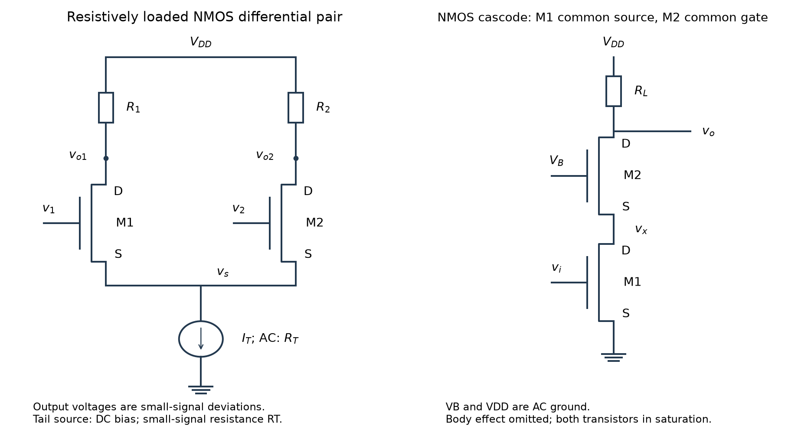
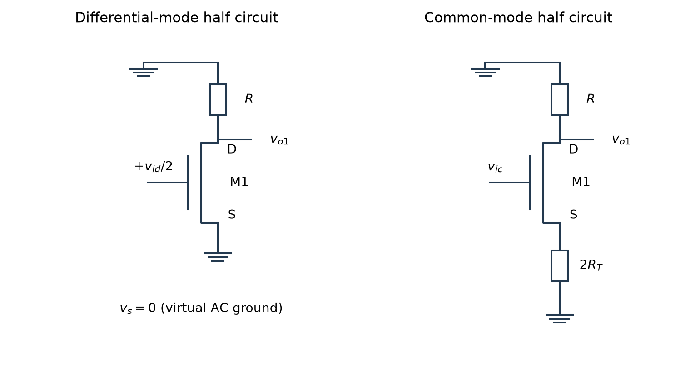

# L005 | 差分对、半电路与共源共栅

- 教材定位：COURSE.md 指定的补充基础，采用标准模拟电路模型与自编讲解；教材小节、印刷页及 PDF 页不适用，不虚构原书出处。
- 先修：L004 的共源反相增益、共栅源端输入特性；L003 的 KCL、交流地和测试源法。
- 学习量：约 60 分钟；先修与引入 5 分钟、物理解释 10 分钟、推导 20 分钟、例题 20 分钟、检查 5 分钟，练习另计。
- 状态：2026-09-21 已生成并自查；掌握情况未评估。
- 公式统一用 Markdown 数学定界：行内美元符号，独立公式双美元符号。

## 1. 本课目标

1. 将任意一对输入分解为差模与共模，并正确还原两路信号。
2. 从节点方程说明差模虚地的条件，画出差模与共模半电路。
3. 算清单端输出、差分输出的增益系数，分析负载失配造成的共模到差模转换。
4. 用内部节点变化与输出电阻解释共源共栅的隔离作用和电压余量代价。

先修补齐：共源级在源极交流固定、忽略输出电阻时满足

$$
v_o=-g_mR_Lv_i.
$$

共栅级从源极输入，源压升高会使栅源电压减小，从而减小漏电流。下面的差分对相当于两个共源支路共享一个源节点；共源共栅则把下方共源管和上方共栅管堆叠起来。

## 2. 从一个具体问题开始

两根线上分别出现“同一个干扰加一个小信号”和“同一个干扰减一个小信号”。能否放大两根线之间的差异，同时抑制共同变化？

例如，两输入都叠加 $10\,\mathrm{mV}$ 的共同扰动，而它们的差值只有 $1\,\mathrm{mV}$。单独观察一根线，共同扰动比目标差值大得多；若电路对两路完全对称，共同变化有机会在输出相减时消掉。

差分对（differential pair）就是为这种任务服务的基本结构。但“用了两个管子”不等于一定能完美抵消：尾电流源和两侧匹配都很重要。

## 3. 电路与物理过程

左图：两只 NMOS 的源极相连，公共节点记为 $v_s$；漏极分别经电阻 $R_1,R_2$ 接理想电源，漏端输出为 $v_{o1},v_{o2}$；尾电流源向下抽取直流电流 $I_T$。在对称偏置下，每管直流电流为尾电流的一半。

右图：下管 M1 为共源，上管 M2 为共栅；中间节点记为 $v_x$，上管栅偏置 $V_B$ 和电源均为交流地。图中 MOS 为简化三端符号，体端省略。

### 3.1 先建立工作点，再谈变化量

两电路都先建立使所有相关 MOS 工作在饱和区的直流偏置，并保留足够电压余量。输入信号足够小，不使器件越过截止、三极区或尾源的工作边界。

本课主推导忽略体效应与器件电容。差分对主推导还先忽略两输入管的沟道长度调制，随后说明有限输出电阻的修正。尾源的小信号输出电阻单独保留为 $R_T$。

理想尾电流源的小信号等效是开路：

$$
R_T\rightarrow\infty.
$$

它仍有直流电流，开路只表示小信号电流变化为零。

### 3.2 差模主要让电流在两支路之间转移

若左输入升高、右输入等量降低，左管电流增加、右管电流减少。在完全对称的小信号条件下，两个增量相消，不需要改变尾电流，公共源节点也不必移动。

因此，左漏压降低，右漏压升高。两个输出相减，会把有用的反向变化相加。

### 3.3 共模主要推动公共源节点一起移动

若两输入一起升高，理想尾源不允许总电流改变。公共源节点便跟随输入上升，让栅源电压几乎不变，从而抑制两支路电流变化。

有限尾电阻允许尾电流改变，源节点跟随不再完全；这会产生共模输出。若两侧完全相同，两个共模输出仍可相减抵消；若负载失配，就会留下差分残差。

## 4. 建模与逐步推导

### 4.1 差模与共模定义：先把二分之一放对

全部小写电压表示相对静态工作点的增量，均以同一参考地测量。定义输入差模、共模电压：

$$
v_{id}=v_1-v_2,\qquad
v_{ic}=\frac{v_1+v_2}{2}.
$$

反过来：

$$
\boxed{v_1=v_{ic}+\frac{v_{id}}{2}},\qquad
\boxed{v_2=v_{ic}-\frac{v_{id}}{2}}.
$$

纯差模激励意味着

$$
v_{ic}=0,\qquad v_1=+\frac{v_{id}}{2},\qquad v_2=-\frac{v_{id}}{2}.
$$

纯共模激励意味着

$$
v_{id}=0,\qquad v_1=v_2=v_{ic}.
$$

若两路分别施加正、负 $1\,\mathrm{mV}$，输入差值是 $2\,\mathrm{mV}$，不是 $1\,\mathrm{mV}$。

输出也定义为：

$$
v_{od}=v_{o1}-v_{o2},\qquad
v_{oc}=\frac{v_{o1}+v_{o2}}{2}.
$$

本文固定采用“左减右”的差分输出。交换相减顺序会改变增益符号。

所有正弦幅值用峰值，增益为电压增益，单位 V/V。输入由理想电压源驱动，不计额外输入分压。

### 4.2 用公共源节点 KCL 证明差模虚地

先令两输入管跨导相同，均为 $g_m$。漏向源的电流增量为：

$$
i_1=g_m(v_1-v_s),\qquad
i_2=g_m(v_2-v_s).
$$

尾电阻电流向下取正，源节点 KCL 为：

$$
i_1+i_2=\frac{v_s}{R_T}.
$$

代入：

$$
g_m(v_1+v_2-2v_s)=\frac{v_s}{R_T}.
$$

因而：

$$
\boxed{v_s=\frac{2g_mR_T}{1+2g_mR_T}v_{ic}}.
$$

在纯差模下，共模输入为零，因此

$$
\boxed{v_s=0}.
$$

这就是虚交流地（virtual AC ground）。它不表示源节点直流电压为零，也不表示那里真的接了一根地线。

特别注意：在对称模型中，纯差模的源节点为零，即使尾电阻有限也成立。支路电流增量已经相消，不需要尾源提供增量电流。

### 4.3 差模半电路与增益

对称电路受反对称激励时，对称面可以视为交流地。左半边就是源极交流接地的共源级，输入仅为总差分输入的一半。

令两负载相等：

$$
R_1=R_2=R.
$$

左支路：

$$
i_1=g_m\frac{v_{id}}{2},\qquad
v_{o1}=-Ri_1=-\frac{g_mR}{2}v_{id}.
$$

右支路：

$$
i_2=-g_m\frac{v_{id}}{2},\qquad
v_{o2}=+\frac{g_mR}{2}v_{id}.
$$

所以，左侧单端输出的差模增益为

$$
\boxed{A_{d,\mathrm{se}}=\frac{v_{o1}}{v_{id}}=-\frac{g_mR}{2}}.
$$

差分输出为：

$$
v_{od}=v_{o1}-v_{o2}=-g_mR,v_{id},
$$

即

$$
\boxed{A_{dd}=\frac{v_{od}}{v_{id}}=-g_mR}.
$$

差分输出增益是单端输出增益的两倍，是因为两个幅度相同、方向相反的输出相减；并不是每只管子的跨导翻倍。

若两输入管的有限输出电阻也相同，电路仍对称，纯差模源节点仍是虚地。每半边的负载改为并联电阻：

$$
A_{d,\mathrm{se}}=-\frac{g_m(R\parallel r_o)}{2},\qquad
A_{dd}=-g_m(R\parallel r_o).
$$

这项修正依赖差模对称条件，不能直接照搬到共模计算中。

### 4.4 共模半电路为什么是两倍尾电阻？

纯共模时，两支路电流相等，设每侧电流增量为 $i$。尾电阻承受的是两侧之和：

$$
v_s=(i+i)R_T=2iR_T.
$$

若只画一个支路，要让同样的支路电流产生同样源压，半电路源极电阻必须为

$$
\boxed{R_{\mathrm{source,half}}=2R_T}.
$$

不是原来的尾电阻，也不是它的一半。

每侧栅源电压为：

$$
v_{gs}=v_{ic}-v_s
=\frac{v_{ic}}{1+2g_mR_T}.
$$

所以每侧电流增量为：

$$
i=\frac{g_m}{1+2g_mR_T}v_{ic}.
$$

对称负载下，两路输出相同：

$$
v_{o1}=v_{o2}
=-\frac{g_mR}{1+2g_mR_T}v_{ic}.
$$

因此：

$$
\boxed{A_{c,\mathrm{se}}=\frac{v_{o1}}{v_{ic}}
=-\frac{g_mR}{1+2g_mR_T}},
$$

$$
\boxed{A_{cd}=\frac{v_{od}}{v_{ic}}=0}.
$$

这里 $A_{cd}$ 特指定“共模输入到差分输出”的转换增益。有限尾电阻可以造成非零的单端共模输出，但在完全对称时，差分共模输出仍为零。

### 4.5 负载失配：为什么共同干扰漏到差分输出？

令两管跨导仍相同，并继续忽略两管的有限输出电阻，但负载不同：

$$
R_1\ne R_2,\qquad \Delta R=R_1-R_2.
$$

在这个简化模型中，漏电流不受漏电压影响，所以纯共模时两个电流增量仍相同。输出却不相等：

$$
v_{o1}=-R_1i,\qquad v_{o2}=-R_2i.
$$

相减得到：

$$
\boxed{A_{cd}
=-\frac{g_m\Delta R}{1+2g_mR_T}}.
$$

纯差模下，两电流仍等量反向，因此：

$$
\boxed{A_{dd}=-\frac{g_m(R_1+R_2)}{2}}.
$$

两式揭示：差模增益由两负载的平均值决定，共模转差模则由两负载的差值决定。

**半电路的限制：** 负载不同后，完整电路已经不具备镜像对称性，不能再用“左右必定相同”的半电路结论。上述简单结果来自完整节点关系，以及忽略器件输出电导的特殊假设。若加入有限输出电阻，漏端变化会反馈到源节点；或者两管跨导也失配，就应重新联立整电路方程。

### 4.6 共源共栅：用共栅管减小内部节点的变化

共源共栅（cascode）将下管 M1 的漏极接到上管 M2 的源极。注意 cascode 与一般多级级联 cascade 不同：这里是共享支路电流的晶体管堆叠。

下管把输入电压转成电流；上管栅极固定。当中间节点上升，上管栅源电压减小，向中间节点供给的漏源电流减小，从而抑制该节点继续升高。

为量化输出对内部节点的影响，现在保留两管输出电阻，忽略体效应，定义：

$$
g_{o1}=\frac{1}{r_{o1}},\qquad g_{o2}=\frac{1}{r_{o2}}.
$$

令输入增量为零，在输出施加测试电压 $v_o$。中间节点电压为 $v_x$。下管电流为：

$$
i_1=g_{o1}v_x.
$$

上管的栅源电压为负的中间节点电压，电流为：

$$
i_2=-g_{m2}v_x+g_{o2}(v_o-v_x).
$$

中间节点 KCL 要求两电流相等：

$$
g_{o1}v_x=-g_{m2}v_x+g_{o2}(v_o-v_x).
$$

整理：

$$
\boxed{\frac{v_x}{v_o}
=\frac{g_{o2}}{g_{m2}+g_{o1}+g_{o2}}}.
$$

当上管跨导远大于两个输出电导之和，输出端的变化只会有一小部分传到中间节点。下管漏源电压较稳定，其有限输出电阻引起的电流变化就较小。这是本课所说的隔离作用；并不是中间节点绝对不动。

求输出电阻时，移除外部负载，令输入为零，向输出注入测试电流 $i_x$。它流经下管输出电阻：

$$
v_x=i_xr_{o1}.
$$

由上管电流关系：

$$
i_x=-g_{m2}v_x+\frac{v_o-v_x}{r_{o2}},
$$

所以：

$$
v_o=i_xr_{o2}+(1+g_{m2}r_{o2})v_x.
$$

代入中间节点电压：

$$
\boxed{R_{\mathrm{out,cas}}
=r_{o1}+r_{o2}+g_{m2}r_{o1}r_{o2}}.
$$

若两管输出电阻相等，且本征增益很大：

$$
R_{\mathrm{out,cas}}\approx g_{m2}r_o^2.
$$

例如两管输出电阻均为 $20\,\mathrm{k\Omega}$，上管跨导为 $4\,\mathrm{mS}$：

$$
R_{\mathrm{out,cas}}=1.64\,\mathrm{M\Omega},\qquad
\frac{v_x}{v_o}\approx0.0122.
$$

输入固定时，输出改变 $1\,\mathrm{mV}$，中间节点只改变约 $12.2\,\mathrm{\mu V}$。这是线性模型的数值，不代表实测或工艺仿真。

## 5. 公式解读与设计取舍

- 差分并不自动意味着增益多一倍：必须说明输入是每侧电压还是两侧之差，输出是单端还是差分。
- 所有增益中的跨导乘电阻均为无量纲；共源共栅输出电阻中的跨导乘两个电阻仍具有欧姆量纲。
- 尾电阻趋于无穷大时，本课简化模型的共模电流变化趋于零；尾电阻趋于零时，源极交流固定，每侧退回一个独立共源级。
- 增大尾电阻可降低单端共模增益，也能减小负载失配下的共模转差模。它不会在本课对称模型中改变纯差模增益。
- 提高负载电阻有利于电压增益，但固定偏置电流下会增加直流压降，限制饱和裕量与摆幅；节点电容存在时还会影响带宽。
- 共源共栅提高输出电阻，但外接负载若远小于它，总等效负载仍主要由外接负载决定，增益提升会受限。

共源共栅还有电压余量代价。在长沟道近似下，下管和上管分别要求：

$$
V_X\gtrsim V_{OV1},\qquad
V_O-V_X\gtrsim V_{OV2}.
$$

因此：

$$
V_O\gtrsim V_{OV1}+V_{OV2}.
$$

堆叠晶体管需要更多电压空间。真实设计还需留裕量；本课低频隔离结果不能直接当作任意频率的隔离指标。

## 6. 例题一：单端与差分增益（自编）

**题目。** 对称差分对，每支跨导 $4\,\mathrm{mS}$、负载 $5\,\mathrm{k\Omega}$。忽略体效应和输入管输出电导。施加纯差模正弦输入，差分峰值为 $1\,\mathrm{mV}$。求每侧输入、支路电流增量、单端输出和差分输出。比较理想尾源与尾电阻为 $20\,\mathrm{k\Omega}$ 的结果。

**解答。** 每侧输入峰值是差分峰值的一半：

$$
v_1=+\frac{v_{id}}{2},\qquad v_2=-\frac{v_{id}}{2}.
$$

在输入差值达到正峰值时：

$$
v_1=+0.5\,\mathrm{mV},\qquad v_2=-0.5\,\mathrm{mV}.
$$

源节点为虚地，两个支路电流增量为：

$$
i_1=(4\,\mathrm{mS})(0.5\,\mathrm{mV})=+2\,\mathrm{\mu A},
$$

$$
i_2=-2\,\mathrm{\mu A}.
$$

于是：

$$
v_{o1}=-(5\,\mathrm{k\Omega})(2\,\mathrm{\mu A})=-10\,\mathrm{mV},
$$

$$
v_{o2}=+10\,\mathrm{mV}.
$$

两者相减：

$$
v_{od}=-20\,\mathrm{mV}.
$$

因此：

$$
\boxed{A_{d,\mathrm{se}}=-10},\qquad
\boxed{A_{dd}=-20}.
$$

两个单端输出峰值都是 $10\,\mathrm{mV}$，相位相反；差分输出峰值为 $20\,\mathrm{mV}$，按左减右定义相对差分输入反相。

两电流增量之和为零，所以有限尾电阻上没有增量压降。尾电阻为 $20\,\mathrm{k\Omega}$ 时，纯差模结果不变。负电流增量只是比静态电流减少，并不意味着实际漏电流反向。

## 7. 例题二：负载相差 2%，共同干扰能否消掉？（自编）

**题目。** 仍取每管跨导 $4\,\mathrm{mS}$。明确规定“负载相差 2%”是相对平均值的差，取：

$$
R_1=5.05\,\mathrm{k\Omega},\qquad
R_2=4.95\,\mathrm{k\Omega}.
$$

即两侧分别偏离标称值正、负 1%，并有：

$$
\frac{R_1-R_2}{(R_1+R_2)/2}=2\%.
$$

两输入同时受到峰值 $10\,\mathrm{mV}$ 的共模扰动。比较理想尾源和尾电阻 $20\,\mathrm{k\Omega}$ 时的输出；仍忽略体效应及输入管输出电导，并假设失配后两管仍保持饱和。

**理想尾源。** 本模型中公共源节点完全跟随共模输入：

$$
v_s=v_{ic},\qquad i_1=i_2=0.
$$

所以两路小信号输出与差分残差均为零。负载失配要把电流变化转换成不相等的压降；此处没有电流变化，因此没有共模转差模。

这不等于没有直流失调。若每支静态电流为尾电流的一半，则电阻失配引起的直流输出差为：

$$
V_{O1}-V_{O2}=-\frac{I_T}{2}(R_1-R_2).
$$

直流失调与本题的小信号共模转换必须分开。

**有限尾电阻。** 先算无量纲分母：

$$
1+2g_mR_T
=1+2(0.004)(20000)=161.
$$

输入共模达到正峰值时：

$$
v_s=\frac{160}{161}(10\,\mathrm{mV})\approx9.9379\,\mathrm{mV}.
$$

每管栅源增量为：

$$
v_{gs}=\frac{10\,\mathrm{mV}}{161}\approx62.11\,\mathrm{\mu V}.
$$

每支电流增量：

$$
i=\frac{(4\,\mathrm{mS})(10\,\mathrm{mV})}{161}
\approx0.24845\,\mathrm{\mu A}.
$$

两漏端电压增量为：

$$
v_{o1}=-iR_1\approx-1.25466\,\mathrm{mV},
$$

$$
v_{o2}=-iR_2\approx-1.22981\,\mathrm{mV}.
$$

差分残差：

$$
\boxed{v_{od}\approx-24.845\,\mathrm{\mu V}}.
$$

也可以直接用转换增益核验：

$$
A_{cd}=-\frac{0.004\times100}{161}
\approx-0.0024845.
$$

乘以共模峰值，得到同样的差分残差。

两负载的平均值仍为 $5\,\mathrm{k\Omega}$，因此差模增益仍是：

$$
A_{dd}=-20.
$$

若用同一差分输出定义共模抑制比（CMRR）：

$$
\mathrm{CMRR}=\left|\frac{A_{dd}}{A_{cd}}\right|=8050,
$$

$$
\mathrm{CMRR}_{\mathrm{dB}}=20\log_{10}(8050)\approx78.12\,\mathrm{dB}.
$$

这是电压增益比，采用二十倍对数。该数值只对应本题失配与尾电阻模型，不是实际芯片指标；不能把差分输出的差模增益与单端输出的共模增益混用。

**判断：** 减小负载差值和提高尾电阻都能减小共模转差模；后者不能消除所有失配、寄生和偏置误差。

## 8. 常见误区

1. 两边分别输入正、负一个差分电压。这样实际差分输入会翻倍；纯差模每侧应是差值的一半。
2. 源节点永远是虚地。只有满足相应对称和激励条件才成立；共模时源节点通常会动。
3. 理想尾源在小信号中应短路。它应开路，因其电流增量为零。
4. 共模半电路用一半尾电阻。正确是两倍，因为真实尾支路流过两个支路电流之和。
5. 有限尾电阻必然造成差分共模输出。完全对称时两路仍可相消；本课的非零转换还需要负载失配。
6. 失配后照搬完全对称的半电路。应先回到整电路方程；某些简化模型的巧合不能作为一般对称依据。
7. 共源共栅能把中间节点完全钳死，且不付代价。隔离是有限的，同时需要更多电压余量。

## 9. 课后练习

以下均为自编题，沿用本课模型。

### 题 1：概念

解释：为什么纯差模下有限尾电阻不影响对称差分对的增益，而纯共模半电路却必须包含两倍尾电阻？若仅左输入变化、右输入交流接地，能否直接把公共源节点当作虚地？

### 题 2：计算

对称差分对每支跨导为 $3\,\mathrm{mS}$、负载为 $8\,\mathrm{k\Omega}$，尾电阻为 $10\,\mathrm{k\Omega}$，忽略体效应及输入管输出电导。纯差模输入峰值为 $2\,\mathrm{mV}$。求每支电流增量峰值、两单端输出峰值、差分输出峰值，以及单端和差分增益。

### 题 3：分析

沿用例题二，要求峰值 $10\,\mathrm{mV}$ 的共模扰动造成的差分输出峰值不超过 $10\,\mathrm{\mu V}$。

1. 负载失配不变，尾电阻至少多大？
2. 若尾电阻固定为 $20\,\mathrm{k\Omega}$，负载差值最多多大？相对平均负载的比例是多少？
3. 提高尾电阻能否同时消除例题二提到的直流输出失调？

### 提示

- 题 1：先分解单边输入的差模、共模分量，再看源节点方程。
- 题 2：差分输入给的是两侧之差；先除以二。
- 题 3：把输出限制换成共模转差模增益限制，再解不等式；区分直流量与增量。

### 独立答案

**题 1。** 纯差模下两支路电流增量等量反向，尾电流增量为零，所以有限尾电阻没有增量压降。共模下两个电流增量相等，尾支路承受两倍支路电流，半电路必须使用两倍尾电阻才能保持源压相同。

若左输入为 $u$、右输入为零：

$$
v_{id}=u,\qquad v_{ic}=\frac{u}{2}.
$$

它同时含有差模和共模。公共源节点为：

$$
v_s=\frac{g_mR_T}{1+2g_mR_T}u.
$$

理想尾源时它趋于输入的一半，并非零。不能直接使用源极接地的纯差模半电路代表完整响应。

**题 2。** 每侧输入峰值为 $1\,\mathrm{mV}$，支路电流增量峰值为：

$$
I_{\mathrm{branch,pk}}=(3\,\mathrm{mS})(1\,\mathrm{mV})=3\,\mathrm{\mu A}.
$$

每侧输出峰值：

$$
V_{o1,\mathrm{pk}}=V_{o2,\mathrm{pk}}=(3\,\mathrm{\mu A})(8\,\mathrm{k\Omega})=24\,\mathrm{mV}.
$$

两路相反，差分输出峰值为 $48\,\mathrm{mV}$。增益为：

$$
A_{d,\mathrm{se}}=-12,\qquad A_{dd}=-24.
$$

左输出相对差分输入反相。有限尾电阻不改变此纯差模结果。

**题 3。** 所需转换增益上限为：

$$
|A_{cd}|\le\frac{10\,\mathrm{\mu V}}{10\,\mathrm{mV}}=0.001.
$$

负载差值不变时：

$$
\frac{0.004\times100}{1+0.008R_T}\le0.001.
$$

其中电阻按欧姆代入。于是：

$$
1+0.008R_T\ge400,
$$

$$
\boxed{R_T\ge49875\,\Omega=49.875\,\mathrm{k\Omega}}.
$$

若尾电阻固定：

$$
\frac{0.004|\Delta R|}{161}\le0.001,
$$

$$
\boxed{|\Delta R|\le40.25\,\Omega}.
$$

相对平均负载的差值比例为：

$$
\frac{40.25}{5000}=0.00805=0.805\%.
$$

这是两负载之差相对平均值的比例；若围绕平均值对称分配，每侧偏离不超过 0.4025%。提高尾电阻减小的是共模扰动造成的电流增量；在直流尾电流不变时，它不会自动消除负载失配造成的直流输出差。

## 10. 掌握检查与下一课

1. 输入差分峰值为 $1\,\mathrm{mV}$ 时，能否不查公式就写出两侧纯差模输入？
2. 能否从电流相消解释差模虚地，并说明共模半电路为何采用两倍尾电阻？
3. 两负载不同后，能否说明哪些对称论证失效，以及本课简化计算还依赖哪些条件？
4. 能否从上管栅源电压变化解释共源共栅的隔离作用，并写出饱和余量限制？

当前尚无用户解题或解释证据，保持“未评估”。下一课 L006 将讲极点、零点、反馈与稳定性基础：本课被忽略的电容会参与电流分配，使增益与相位随频率变化。

## 11. 出处与自查

- 依据 COURSE.md 的 L005 备课卡；本课全部推导、例题、练习及图均为补充基础与自编内容，没有借用未核实的原书页码、图号或题号。
- 已独立核对：差分因子、差模与共模源节点、半电路尾电阻、负载失配方向、增益定义、共源共栅测试源公式、数值与量纲及边界。
- `L005/draw_and_check.py` 以整电路节点方程检查例题与有限输出电阻的对称差模情况，并生成 SVG、PNG 电路图；已实际运行。它是备课核算，不是晶体管级或工艺仿真，本课没有另设软件实验。
- 数学定界统一为美元符号，图文连接与标注已检查。

## 用户笔记与作业

尚未收到本课用户笔记或作业。
