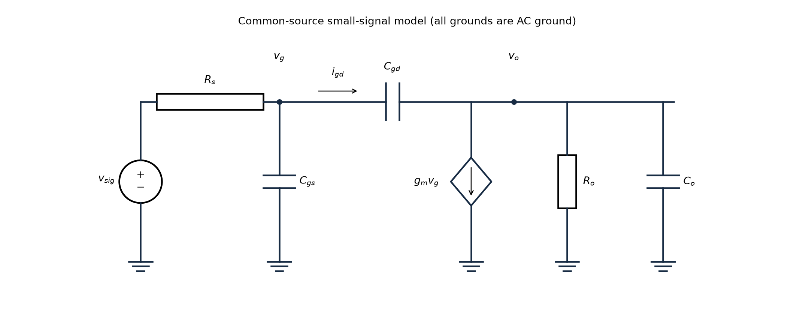
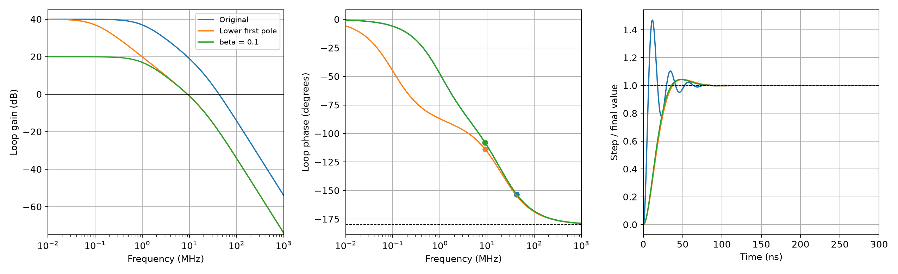

# L006 | 极点、零点、反馈与稳定性基础

- 教材定位：本课为 COURSE.md 指定的**补充基础**，使用标准模拟电路与线性系统模型；教材小节、印刷页、PDF 页均不适用，不将自编推导冒充原书内容。
- 先修课：L003 的小信号模型、KCL 与交流地；L005 的共源反相增益和共源共栅隔离作用。
- 学习量：约 60 分钟。先修与引入 5 分钟、物理解释 10 分钟、推导 20 分钟、例题 20 分钟、掌握检查 5 分钟；数值实验和课后题另计。
- 状态：2026-09-21 已生成并自查；掌握情况未评估。

## 1. 本课目标

1. 从共源级的两个节点方程写出传递函数，并在极点充分分离时估计主导极点。
2. 从跨接电容的电流推导米勒效应，解释为什么小小的栅漏电容会明显限制输入带宽。
3. 计算两极点环路的增益交越频率与相位裕度，并用闭环极点复核稳定性。
4. 区分极点、零点、谐振频率，以及“稳定但振铃”与“不稳定”。

先修补齐：NMOS 在饱和区的偏置附近，小信号漏电流为 $g_mv_{gs}$。若源极交流接地、漏端等效电阻为 $R_o$，低频增益为 $v_o/v_g=-g_mR_o$。负号表示栅压上升使漏电流增加、漏压下降。本课加入电容，考察这个过程能跟上多快的变化。

## 2. 从一个具体问题开始

一个共源级的中频电压增益为 $-20$，栅源电容 $C_{gs}=0.5\,\mathrm{pF}$，栅漏电容只有 $C_{gd}=0.1\,\mathrm{pF}$。由 $10\,\mathrm{k\Omega}$ 的信号源驱动。

如果直接把输入电容当作 $C_{gs}+C_{gd}=0.6\,\mathrm{pF}$，会预测输入极点约 $26.5\,\mathrm{MHz}$。这个估计为什么过于乐观？

另一个问题：将低频增益为 100 的放大器接成负反馈，是否就一定得到平稳响应？

这两个问题都来自电容储存电荷：改变节点电压需要时间；多个节点的动态过程又会让反馈逐渐滞后。在收发机中，这影响放大器带宽、基带滤波与后续 PLL 的稳定性分析。

## 3. 物理过程与直觉

### 3.1 电容限制电压变化速度

电容电流满足

$$i_C=C\frac{dv_C}{dt}.$$

同样的电压变化，要求完成得越快，所需电流越大。若驱动能力有限，输出无法瞬间跟随；交流稳态下便出现幅度下降和相位滞后。

最简单的串联 $R$、对地 $C$ 低通，输出取电容两端：

$$\frac{v_i-v_o}{R}=C\frac{dv_o}{dt}.$$

在零初始条件下，拉普拉斯变换把微分变为乘 $s$：

$$H(s)=\frac{V_o(s)}{V_i(s)}=\frac1{1+sRC}.$$

分母在 $s=-1/(RC)$ 为零，这就是极点（pole）。自然响应按 $e^{-t/(RC)}$ 衰减，因此极点同时告诉我们时间上的衰减速度。

### 3.2 跨接电容的另一端也在动

若栅压增加 $1\,\mathrm{mV}$，共源输出下降约 $20\,\mathrm{mV}$，那么栅漏电容两端的电压增加约 $21\,\mathrm{mV}$。

输入端给这只电容搬运的电荷，远大于把其另一端固定在地时的情况。因此，虽然物理电容只有 $0.1\,\mathrm{pF}$，从输入端看却可能像 $2.1\,\mathrm{pF}$。这是米勒效应（Miller effect）；物理电容的几何尺寸并没有改变。

### 3.3 反馈也有动态过程

负反馈检测输出误差并纠正它。如果纠正动作积累了很大的相位滞后，就可能在误差已经反向时仍沿原方向推动输出，造成超调与振铃。是否会持续增长，需要检查整个环路的幅相，不能只看直流接线的正负号。

## 4. 建模与逐步推导

### 4.1 电路、方向与约定

图中是**小信号等效电路**：

- NMOS 先偏置在饱和区，输入足够小，保证线性化有效。源极与体端为交流地，因此 $v_{gs}=v_g$，体效应增量为零。
- $v_{sig}$ 是戴维南信号源，$R_s$ 是它的串联输出电阻，不是 MOS 源极电阻。
- $v_g$、$v_o$ 分别为栅节点和漏节点相对交流地的电压；输出为单端电压。
- $R_o=R_D\parallel r_o\parallel R_L$，所有交流固定的电源在小信号图中接地。
- $C_o$ 汇总输出对地电容，**不包含**跨接的 $C_{gd}$；$C_{gs}$ 与 $C_{gd}$ 单独保留。
- 受控电流源 $g_mv_g$ 从漏端流向地；$i_{gd}$ 的正方向为栅到漏。KCL 统一用流出节点为正。
- 采用准静态、集总、小信号模型，忽略栅漏电、电感、分布效应及更高频器件动态。

以下 $s=\sigma+j\omega$，频率响应取 $s=j\omega$，且 $\omega=2\pi f$。角频率单位为 rad/s，普通频率为 Hz。电压增益与环路增益用 $20\log_{10}|\cdot|$；本课不计算功率增益或噪声 PSD。正弦电压可统一用峰值相量，改用 RMS 相量不改变增益比；阶跃响应按最终值归一化。

### 4.2 先列两个节点方程

栅节点：

$$\frac{v_g-v_{sig}}{R_s}+sC_{gs}v_g+sC_{gd}(v_g-v_o)=0.$$

三项分别是经源电阻、栅源电容、栅漏电容流出的电流。

漏节点：

$$\frac{v_o}{R_o}+sC_ov_o+sC_{gd}(v_o-v_g)+g_mv_g=0.$$

整理成

$$\left[\frac1{R_s}+s(C_{gs}+C_{gd})\right]v_g-sC_{gd}v_o=\frac{v_{sig}}{R_s},$$

$$ (g_m-sC_{gd})v_g+\left[\frac1{R_o}+s(C_o+C_{gd})\right]v_o=0.$$

由第二式得到栅到漏的增益：

$$\frac{v_o}{v_g}=-\frac{g_m-sC_{gd}}{1/R_o+s(C_o+C_{gd})}.$$

这一步暂时没有把输入源电阻造成的衰减算进去。

联立两式。系数行列式为

$$D(s)=\left[\frac1{R_s}+s(C_{gs}+C_{gd})\right]\left[\frac1{R_o}+s(C_o+C_{gd})\right]+sC_{gd}(g_m-sC_{gd}).$$

分子为 $-(g_m-sC_{gd})/R_s$。分子分母同乘 $R_sR_o$，可得

$$\boxed{\frac{v_o}{v_{sig}}=\frac{-g_mR_o(1-sC_{gd}/g_m)}{1+a_1s+a_2s^2}}$$

其中

$$\boxed{a_1=R_s(C_{gs}+C_{gd})+R_o(C_o+C_{gd})+g_mR_sR_oC_{gd}}$$

$$\boxed{a_2=R_sR_o(C_{gs}C_o+C_{gs}C_{gd}+C_{gd}C_o).}$$

二次项中没有 $C_{gd}^2$：展开行列式时两项恰好抵消。$a_1$ 单位为秒，$a_2$ 单位为秒平方，所以分母每一项都无量纲。

### 4.3 从分母找主导极点

若两个极点为实负数，将分母写成

$$1+a_1s+a_2s^2=(1+s/\omega_{p1})(1+s/\omega_{p2}),$$

其中 $\omega_{p1},\omega_{p2}>0$ 是极点角频率的大小，实际极点位于 $s=-\omega_{p1},-\omega_{p2}$。

比较系数：

$$a_1=\frac1{\omega_{p1}}+\frac1{\omega_{p2}},\qquad a_2=\frac1{\omega_{p1}\omega_{p2}}.$$

若 $\omega_{p2}\gg\omega_{p1}$，等价地要求 $a_1^2\gg4a_2$，则

$$\boxed{\omega_{p1}\approx\frac1{a_1},\qquad \omega_{p2}\approx\frac{a_1}{a_2}.}$$

低频极点最先改变响应，称主导极点（dominant pole）。极点不充分分离时，应解二次方程，不能强行把每个节点对应成一个独立的 $RC$。

### 4.4 米勒近似从电流推出来

定义 $A_v(s)=v_o/v_g$，跨接电容从输入抽取的电流为

$$i_{gd}=sC_{gd}(v_g-v_o)=sC_{gd}[1-A_v(s)]v_g.$$

若所关心频段内 $A_v(s)\approx A_{v0}$，而且 $A_{v0}$ 近似实常数，则输入侧可等效为对地电容

$$C_{M,in}=C_{gd}(1-A_{v0}).$$

共源级 $A_{v0}=-g_mR_o$，所以

$$\boxed{C_{in}\approx C_{gs}+C_{gd}(1+g_mR_o).}$$

输入形成近似低通：

$$\frac{v_g}{v_{sig}}\approx\frac1{1+sR_sC_{in}},\qquad \boxed{f_{p,in}\approx\frac1{2\pi R_sC_{in}}.}$$

输出侧同理由 $sC_{gd}(v_o-v_g)$ 得到

$$C_{M,out}=C_{gd}\left(1-\frac1{A_{v0}}\right).$$

对 $A_{v0}=-20$，输入倍增系数为 21，输出倍增系数只有 1.05。两侧不能都乘 21。

**适用条件：**栅到漏增益在估计的输入极点附近仍接近中频值；输出本身的动态拐点与前馈零点要足够远。若想进一步把输入极点当作整个级的主导极点，还应确认输入时间常数明显占优。严格式中

$$a_1=R_sC_{in}+R_o(C_o+C_{gd}),$$

可以直接看出遗漏了哪个输出时间常数。若增益已随频率显著变化，$C_{gd}[1-A_v(s)]$ 是频率相关等效导纳的一部分，不能简单当作固定物理电容。

### 4.5 零点以及右半平面零点

零点（zero）使传递函数分子为零。本模型给出

$$\boxed{s_z=+\frac{g_m}{C_{gd}}.}$$

它位于右半平面，称 RHP zero。输出一方面由 $g_mv_g$ 反相驱动，另一方面经 $C_{gd}$ 直接前馈；两条路径的组合产生分子 $1-s/\omega_z$。

这里的零点在正实轴，**不表示在某个实数频率 $f_z$ 出现幅度为零的陷波**。频率响应沿 $s=j\omega$ 取值，$1-j\omega/\omega_z$ 不会为零。

对比两个归一化零点因子：

| 因子 | 高频幅度趋势 | 相位贡献 |
|---|---|---|
| 左半平面零点 $1+s/\omega_z$ | 最终增加 $20\,\mathrm{dB/dec}$ | $+\arctan(\omega/\omega_z)$ |
| 右半平面零点 $1-s/\omega_z$ | 同样最终增加 $20\,\mathrm{dB/dec}$ | $-\arctan(\omega/\omega_z)$ |

所以不能笼统说“零点都提供相位超前”。若该零点远超准静态模型的适用频段，其精确位置不能当作真实晶体管的高频预测。

### 4.6 极点不是谐振频率

单极点低通有

$$|H(j\omega)|=\frac1{\sqrt{1+(\omega/\omega_p)^2}},\qquad \angle H=-\arctan(\omega/\omega_p).$$

在 $\omega_p$ 处幅度为低频值的 $1/\sqrt2$，相位为 $-45^\circ$；高频每增加十倍，幅度约下降 20 dB。它没有谐振峰。

对二阶低通

$$H(s)=\frac{\omega_n^2}{s^2+2\zeta\omega_ns+\omega_n^2},$$

当 $0<\zeta<1$ 时，极点为

$$s=-\zeta\omega_n\pm j\omega_n\sqrt{1-\zeta^2}.$$

其中 $\omega_n$ 是无阻尼自然角频率，振铃角频率为 $\omega_d=\omega_n\sqrt{1-\zeta^2}$。幅频峰值只有在 $\zeta<1/\sqrt2$ 时才出现在非零频率，并位于

$$\omega_r=\omega_n\sqrt{1-2\zeta^2}.$$

这些量有联系，却不是同一个量；有复极点也不保证有幅频峰值。

### 4.7 从闭环方程定义环路增益

以下是一个独立的反馈系统模型；前面的共源级负增益不能不检查符号就直接代入。

定义 $e=x-\beta y$、$y=Ae$，则

$$y=A(x-\beta y),$$

$$\boxed{H_{cl}(s)=\frac{y}{x}=\frac{A(s)}{1+A(s)\beta(s)}.}$$

本课把环路增益定义为 $L(s)=A(s)\beta(s)$，不包含求和点的负号。危险位置是 $L=-1$，即幅度为 1、相位为 $-180^\circ$，因为此时 $1+L=0$。

定义增益交越频率（gain crossover frequency）：

$$|L(j\omega_c)|=1.$$

相位采用从低频连续展开的分支。相位裕度（phase margin）为

$$\boxed{PM=180^\circ+\angle L(j\omega_c).}$$

例如交越处为 $-150^\circ$，则还有 $30^\circ$ 才到 $-180^\circ$，故 $PM=30^\circ$。PM 是角度，不是 dB。

本课的环路开环稳定、没有隐藏不稳定模式，幅值单调下降且只有一次交越，适合这样分析裕度。一般系统若有右半平面开环极点、多次交越或复杂延迟，需要检查完整 Nyquist 条件或闭环特征根，不能孤立地用一个 PM 数字宣布稳定。

## 5. 公式说明与设计取舍

| 关系 | 物理意义与检查 | 设计代价 |
|---|---|---|
| $f_p=1/(2\pi RC)$ | $RC$ 单位为秒；电阻、电容越大，充放电越慢 | 降低驱动输出电阻可能需要更强驱动和更多偏置功耗 |
| $C_{in}=C_{gs}+C_{gd}(1-A_v)$ | $A_v=0$ 时另一端不动；$A_v\approx1$ 时跨接电容两端近似同动；反相增益越大，输入等效电容越大 | 提高单级反相增益可能降低输入带宽 |
| 共源共栅限制下管漏端摆幅 | 下管 $C_{gd}$ 两端电压的放大量减小 | 增加内部节点和寄生，消耗电压余量；仍须检查其他极点 |
| 降低第一极点 | 可让交越发生在第二极点造成很大滞后之前 | 降低交越频率，通常降低响应带宽；不能因此断言总建立时间一定变差 |

边界复核：当 $C_{gd}\to0$，精确分母变成 $(1+sR_sC_{gs})(1+sR_oC_o)$，米勒耦合与有限零点消失。若 $R_s\to0$，栅节点由理想电压源钳住，输入 $RC$ 限制消失，但输出动态仍存在。

## 6. 例题一：估计输入极点（自编）

**题目。**中频栅到漏增益 $A_{v0}=-20$，$C_{gd}=0.1\,\mathrm{pF}$，$C_{gs}=0.5\,\mathrm{pF}$，$R_s=10\,\mathrm{k\Omega}$。用米勒近似估计输入极点，并说明能否据此确定整个放大器的精确带宽。

**第一步：算输入等效电容。**

$$C_{M,in}=0.1[1-(-20)]=2.1\,\mathrm{pF},$$

$$C_{in}=0.5+2.1=2.6\,\mathrm{pF}.$$

**第二步：算时间常数。**

$$\tau_{in}=10^4\times2.6\times10^{-12}=26\,\mathrm{ns}.$$

**第三步：换成 Hz。**

$$\boxed{f_{p,in}=\frac1{2\pi\times26\,\mathrm{ns}}\approx6.12\,\mathrm{MHz}.}$$

对应角频率为 $3.846\times10^7\,\mathrm{rad/s}$，不能把这个数直接当作 Hz。

**第四步：比较错误估计。**若直接用 $0.6\,\mathrm{pF}$，会得到 $26.53\,\mathrm{MHz}$，高估约 4.33 倍。错误来自把会反向摆动的漏端当成地。

**结论的边界。**题目没有给出独立的 $g_m$、$R_o$、$C_o$，只给增益乘积，因此只能得到有条件的输入极点估计。不能证明第二极点足够高，也不能把 6.12 MHz 宣称为精确整级带宽。

作为另加参数的自编复核，若取 $g_m=2\,\mathrm{mS}$、$R_o=10\,\mathrm{k\Omega}$、$C_o=0.2\,\mathrm{pF}$，确有 $g_mR_o=20$。此时 $a_1=29\,\mathrm{ns}$，$a_2=17\,\mathrm{ns^2}$，两精确极点频率约为 5.60 MHz 和 265.90 MHz。差异提醒我们：输入米勒估计虽有用，输出时间常数并非严格为零。这组新增参数不属于原题已知量。

## 7. 例题二：负反馈是否足够平稳（自编）

**题目。**独立的前向电压放大器为

$$A(s)=\frac{100}{(1+s/\omega_1)(1+s/\omega_2)},$$

其中 $f_1=1\,\mathrm{MHz}$、$f_2=20\,\mathrm{MHz}$，$\omega_i=2\pi f_i$。采用 $e=x-y$ 的单位负反馈，即 $\beta=1$。忽略其他极点、零点和延迟。求交越频率、相位裕度，判断稳定性；再讨论把第一极点降到 0.1 MHz 的结果。

### 第一步：求真实交越频率

$$|L(j2\pi f)|=\frac{100}{\sqrt{[1+(f/f_1)^2][1+(f/f_2)^2]}}.$$

令 $x=f_c/(1\,\mathrm{MHz})$，有

$$ (1+x^2)(1+x^2/400)=10000,$$

$$x^4+401x^2-3999600=0.$$

取 $x^2$ 的正根，再开方：

$$x^2=\frac{-401+\sqrt{401^2+4\times3999600}}2,$$

$$\boxed{f_c\approx42.54\,\mathrm{MHz}.}$$

不能直接用单极点结果 $100\times1\,\mathrm{MHz}=100\,\mathrm{MHz}$：第二极点在 20 MHz，已经在交越前显著影响增益。

### 第二步：算相位裕度

$$\angle L(j2\pi f_c)=-\arctan(f_c/f_1)-\arctan(f_c/f_2),$$

$$\angle L\approx-153.47^\circ,$$

$$\boxed{PM\approx26.53^\circ.}$$

这个裕度较小，说明响应可能有明显峰化和振铃。但它不等于已经不稳定。

### 第三步：用闭环分母独立判断

$$H_{cl}(s)=\frac{100\omega_1\omega_2}{s^2+(\omega_1+\omega_2)s+101\omega_1\omega_2}.$$

二阶分母各系数为正：实根时两根均负；复根时实部为 $-(\omega_1+\omega_2)/2<0$。因此该理想模型闭环稳定。

与标准二阶形式比较：

$$\omega_n=\sqrt{101\omega_1\omega_2},$$

$$\zeta=\frac{\omega_1+\omega_2}{2\sqrt{101\omega_1\omega_2}}\approx0.2336.$$

对本题无零点的欠阻尼二阶系统，阶跃超调相对最终值为

$$M_p=\exp\left[-\frac{\pi\zeta}{\sqrt{1-\zeta^2}}\right]\approx0.4701.$$

即约 **47.0% 超调**。单位阶跃最终输出为 $100/101\approx0.9901$，并非严格为 1。这里 47% 是相对于最终输出的比例。

### 第四步：改变第一极点

保持直流增益 100、第二极点 20 MHz 和单位反馈不变，仅把 $f_1$ 改为 0.1 MHz。重复幅值方程和相位计算：

$$\boxed{f_c\approx9.10\,\mathrm{MHz},\quad PM\approx66.16^\circ.}$$

此时 $\zeta\approx0.7071$，阶跃超调约 4.32%。交越降低，第二极点在交越处带来的滞后减小，响应更平稳。

代价是交越频率和自然频率降低。不过总建立时间还取决于振铃和误差容限，不能只凭交越降低就说建立时间一定变长。这里只比较理想模型；真实补偿电容可能同时移动其他极点并引入零点，不能假定只改一个参数。

## 8. 数值实验：看见相位裕度与振铃

三条曲线分别为：蓝色原始单位反馈；橙色把第一极点降到 0.1 MHz；绿色保持原放大器、改成 $\beta=0.1$。中图圆点是各自的增益交越位置；右图各响应除以自己的最终值，以比较超调，不能由此误认为三者的直流增益相同。

- 模型：例题中的连续时间线性两极点模型，无额外延迟和零点；不是晶体管级或工艺仿真。
- 参数：$A_0=100$，$f_2=20\,\mathrm{MHz}$；$f_1$、$\beta$ 按上述三种情形取值。
- 扫频：$10^4$ 到 $10^{10}\,\mathrm{Hz}$，2400 个对数点；图中展示 0.01–1000 MHz。阶跃时间为 0–300 ns，共 3000 点。
- 方法：二分法求 $|L|=1$，二次方程求闭环极点，用极点展开计算阶跃，再和标准二阶超调式交叉核对。没有随机过程，不需随机种子。
- 代码：[verify.py](L006/verify.py)，结果：[results.json](L006/results.json)。需要 Python、NumPy 和 Matplotlib。从项目根目录运行 `python lessons/L006/verify.py`。
- 预期现象与实际结果一致：原始情形有明显衰减振铃，另外两种情形超调减小。脚本已实际运行，并检查交越方程、闭环极点实部和阶跃峰值。

## 9. 常见误区

1. **“极点就是谐振频率。”**一阶 RC 有极点却没有谐振峰；二阶自然频率、振铃频率和峰值频率也不同。
2. **“Cgd 很小，可以直接忽略。”**先看 $C_{gd}(1-A_v)$；例题中 0.1 pF 对输入的贡献大于原有 0.5 pF。
3. **“米勒增益用整个信号源到输出的增益。”**跨接电容两端是栅和漏，必须用 $v_o/v_g$，不能混成 $v_o/v_{sig}$。
4. **“每个节点各算 RC，就有精确极点。”**跨接电容耦合节点；精确极点来自联立方程的分母。
5. **“负反馈必然稳定，PM 小就必然不稳定。”**前一句忽略频率相关相位，后一句混淆裕度与稳定性。例题 PM 约 26.5°，稳定但振铃很强。
6. **“零点都能补偿相位滞后。”**右半平面零点增加相位滞后；左右半平面零点却可有相同幅频变化。
7. **“交越频率就是闭环 −3 dB 带宽。”**交越由 $|A\beta|=1$ 定义；闭环带宽由 $|A/(1+A\beta)|$ 定义。有峰化时更不能混用。

## 10. 课后练习

### 题目

1. **概念题。**一个 RC 低通在 10 MHz 有极点，能否说它在 10 MHz 谐振？再解释 $A_v=-20$ 时，为什么 0.1 pF 的栅漏电容对应约 2.1 pF 输入电容，而非 2.0 pF。
2. **计算题（自编）。**将例题一改成 $A_v=-10$、$R_s=5\,\mathrm{k\Omega}$，保持 $C_{gs}=0.5\,\mathrm{pF}$、$C_{gd}=0.1\,\mathrm{pF}$。估计输入极点，并说明是否足以证明整级带宽。
3. **分析题（自编）。**例题二的原始放大器不变，反馈系数改成 $\beta=0.1$。求交越频率、PM 和闭环直流增益。若任务仍要求单位电压增益，能否把它直接当作等价的稳定性改进方案？

### 提示

1. 极点描述自然响应与传递函数分母；跨接电容电压是 $v_g-v_o$。
2. 先算 $C_{in}=C_{gs}+C_{gd}(1-A_v)$，再算 $R_sC_{in}$。
3. 环路低频增益变成 $A_0\beta=10$，闭环增益仍需用 $A_0/(1+A_0\beta)$。

### 练习解答（先独立作答，再阅读）

**第1题。**不能。一阶 RC 低通幅值随频率单调下降，在极点频率下降 3.01 dB，不出现峰值。栅压上升 $\Delta v$ 时漏压下降 $20\Delta v$，所以跨接电容的电压变化为 $\Delta v-(-20\Delta v)=21\Delta v$。多出的“1”来自输入端自身的变化，故为 $21\times0.1=2.1\,\mathrm{pF}$。

**第2题。**

$$C_{in}=0.5+0.1(1+10)=1.6\,\mathrm{pF},$$

$$\tau=5\times10^3\times1.6\times10^{-12}=8\,\mathrm{ns},$$

$$\boxed{f_{p,in}=\frac1{2\pi\times8\,\mathrm{ns}}\approx19.89\,\mathrm{MHz}.}$$

源电阻减小和反相增益绝对值减小都提高了输入极点频率；但仍缺输出动态信息，不能证明整级带宽，且电压增益已经牺牲了一半。

**第3题。**令 $x=f_c/(1\,\mathrm{MHz})$：

$$ (1+x^2)(1+x^2/400)=10^2,$$

$$x^4+401x^2-39600=0.$$

解得

$$\boxed{f_c\approx9.05\,\mathrm{MHz},}$$

$$\boxed{PM=180^\circ-\arctan(9.0548)-\arctan(9.0548/20)\approx71.94^\circ.}$$

闭环直流增益为

$$\boxed{H_{cl}(0)=\frac{100}{1+100\times0.1}=9.09.}$$

相位裕度增大，但已不满足单位增益要求。即使目标是增益 10，9.09 相对理想值仍低约 9.09%，说明有限环路增益会影响精度。减小反馈系数还减弱了低频误差抑制能力，不能只看 PM 的提升。

## 11. 掌握检查与下一课

请在不翻讲义的情况下完成以下检查：

1. 写出栅、漏两个节点的 KCL，解释为什么两个 $C_{gd}$ 电流项的参考方向相反。
2. 用电容两端电压变化解释米勒系数中的 $1-A_v$，并说出固定电容近似的适用条件。
3. 说明为什么两极点例题不能用 $A_0f_1$ 直接求交越频率。
4. 回答“PM 为 26.5° 的系统是否不稳定”，并给出闭环极点或阻尼的证据。
5. 举出有极点却无谐振峰的例子，区分交越频率和闭环带宽。

尚未收到解题或解释证据，因此掌握状态保持**未评估**。下一课 L007 讲相量、频谱、卷积与频谱搬移：本课研究系统怎样改变各频率的幅相，下一课把这件事与任意信号的频谱以及混频相连。

## 12. 出处与自查

- 课程范围、先修与两道例题要求来自 COURSE.md 的 L006 条目；本课属于补充基础，不指定教材小节、印刷页或 PDF 页，不引用原书例题编号。
- 两节点推导、参数补充、反馈例题及作业均为标准模型下的自编内容；电路图为该模型的小信号等效图。
- 已核对：KCL 与受控源方向、分母交叉项、右半平面零点符号、$C_{gd}\to0$ 与 $R_s\to0$ 边界、Hz/rad/s 换算和反馈求和符号。
- 已实际运行 verify.py，复核例题与练习数值、交越方程、闭环根与阶跃超调；图示已查看，曲线颜色、交越标记和归一化定义一致。

## 用户笔记与作业

尚未收到用户笔记或作业；后续内容保留于此，不用生成讲义推断已掌握。
