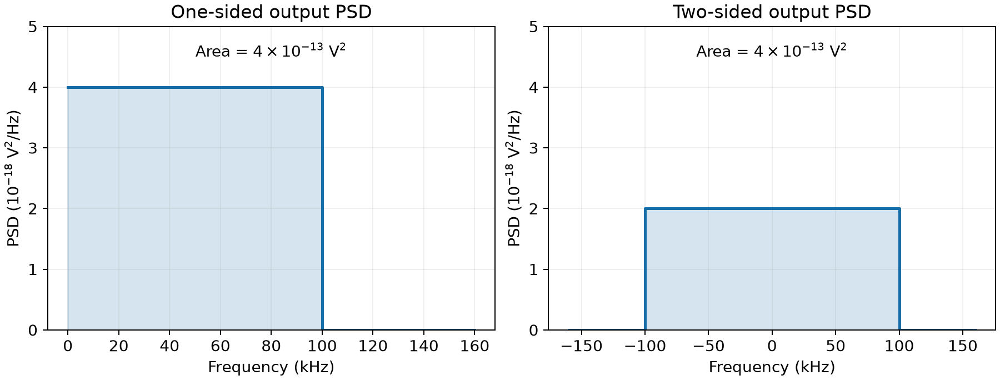
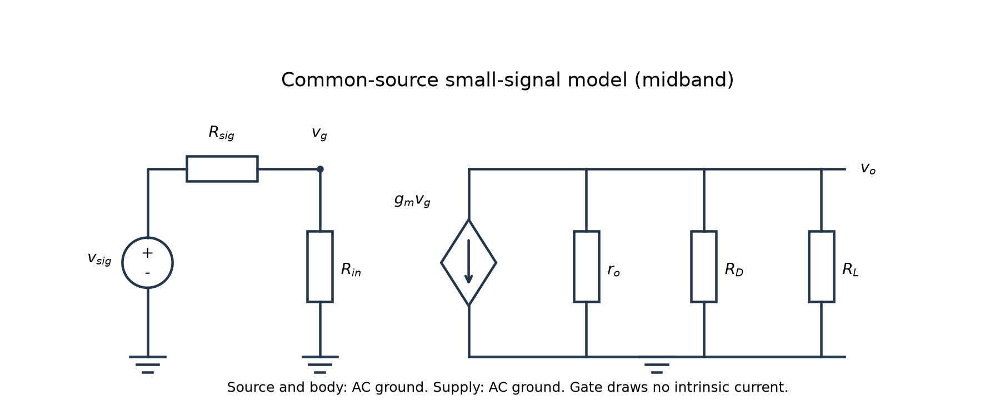

# L008 | 随机过程、相关性与噪声谱

- 教材定位：本课为**补充基础**，统计定义、推导和题目为自编，不虚构对应教材页码。衔接阅读：§2.3.1（印刷 36–37；PDF 61–62）、§2.3.2（印刷 37–39；PDF 62–64）、§2.3.3（印刷 39–40；PDF 64–65）；L017 会进一步讲授。
- 先修课：L007 的频谱与线性时不变滤波。阶段诊断调用 L002–L005 的 MOS 小信号、共源级与差分量。
- 学习量：约 60 分钟；先修与问题 5 分钟、物理直觉 10 分钟、推导 20 分钟、例题 15 分钟、检查 10 分钟。课后练习与阶段独立作答另计。
- 状态：2026-09-22 已生成并自查；掌握情况未评估。
- 公式约定：行内使用美元符号数学定界，独立公式使用双美元符号，并以 L008 连续编号。

## 1. 本课目标

1. 区分随机波形、均值、方差与 RMS，解释零均值为什么不等于零噪声。
2. 从平方展开推导两随机量相加的方差，按相关性选择合成方法。
3. 写出单边、双边 PSD 的单位和积分范围，通过滤波器求噪声 RMS。
4. 独立完成共源加载增益与噪声计算，并解释源阻抗或相关性改变后的结果。

先修补齐：L007 中，线性时不变系统（LTI）对每个频率分量乘上复数传递函数。噪声也会被滤波，但我们无法预先列出它每一时刻的值。本课追踪的是**均方大小怎样分布在频率轴上**。电压幅度乘增益，均方量就乘增益的模平方。

## 2. 从一个具体问题开始

接收机输出端有两项零均值噪声，分别为 3 μV RMS 和 4 μV RMS。总噪声是多少？

只给两个 RMS，不能唯一回答。若两项互不相关，结果为 5 μV；若它们是同一噪声的固定正比例副本，结果为 7 μV；若完全反相关，结果为 1 μV。

**决定结果的不只是每项有多大，还有它们是否一起变化。**这也是差分电路与噪声抵消的基础。

另一个问题：噪声密度为 2 nV/√Hz，是否意味着总噪声为 2 nV？不能这样判断，还需要知道滤波器和测量带宽。

## 3. 物理过程与直觉

### 3.1 为什么平均为零，仍有噪声？

载流子的热运动会扰动电压、电流。正负扰动的长期平均可以抵消，平方后却都非负。电阻即使没有直流电流，也可以存在热噪声。

例如电压等概率取 +1 μV 和 −1 μV：均值为零，均方值为一个平方微伏，RMS 为 1 μV。RMS 是均方根（root mean square），不是正负相加后的平均。

### 3.2 随机波形与统计量

在相同条件下反复测量，每次获得不同曲线。每条曲线称为样本函数（realization）；所有可能曲线及其概率规律构成随机过程（random process）。

固定时刻、比较多次实验，得到该时刻随机变量的分布；固定一次实验、沿时间观察，得到一条随机波形。

本课的期望是总体统计平均。仪器只能测有限时间；只有满足相应遍历性（ergodicity）条件、记录又足够长时，时间平均才能可靠地估计总体平均。**平稳本身不保证遍历。**

### 3.3 相关性描述什么？

如果第一项偏正时，第二项也倾向偏正，相加更容易增强；如果第二项倾向偏负，相加更容易抵消。

同一噪声源分成两路，不能因为经过两个电路就当作两个不相关来源。路径的幅度、相位和延迟都可能影响合成结果。

## 4. 建模与逐步推导

### 4.1 统一约定

- 除阶段题的差分量外，电压均为相对于共同参考地的实值单端电压。
- 电路围绕稳定直流工作点线性化，噪声是小扰动；忽略噪声引起的压缩、工作区切换及工作点漂移。
- 默认扣除直流均值，随后讨论零均值噪声。含直流的总 RMS 单独说明。
- 随机噪声没有固定峰值，不能一律将 RMS 乘 $\sqrt{2}$ 当作峰值。
- $f$ 使用 Hz，$\omega$ 使用 rad/s；本课 PSD 全部按 Hz 定义并对 $df$ 积分。
- $S^{(1)}$ 表示单边 PSD，$S^{(2)}$ 表示双边 PSD；二者都不是 L007 的复幅度频谱。
- 滤波使用稳定 LTI 模型和稳态输出，并要求输出噪声积分有限。理想砖墙低通仅作带限教学模型。

### 4.2 均值、方差与 RMS

固定一个时刻，对随机电压 $x$ 定义：

$$
\mu_x=\mathbb E[x],\qquad
\widetilde x=x-\mu_x,\qquad
\sigma_x^2=\mathbb E[(x-\mu_x)^2].
\tag{L008-01}
$$

把平方展开，并利用期望的线性性：

$$
\begin{aligned}
\sigma_x^2
&=\mathbb E[x^2-2\mu_xx+\mu_x^2]\\
&=\mathbb E[x^2]-2\mu_x\mathbb E[x]+\mu_x^2\\
&=\mathbb E[x^2]-\mu_x^2.
\end{aligned}
\tag{L008-02}
$$

因此：

$$
x_{\mathrm{rms}}=\sqrt{\mathbb E[x^2]}
=\sqrt{\mu_x^2+\sigma_x^2};
\qquad
\mu_x=0\ \Longrightarrow\ x_{\mathrm{rms}}=\sigma_x.
\tag{L008-03}
$$

均值单位为 V；方差、均方值单位为 V²；标准差、RMS 单位为 V。测量直流偏置上的噪声时，通常报告扣除直流后的 RMS。

### 4.3 两项噪声的方差

设瞬时输出电压为两项之和：

$$
z=x+y,\qquad
\mu_z=\mu_x+\mu_y,\qquad
\widetilde z=\widetilde x+\widetilde y.
\tag{L008-04}
$$

先对去均值后的和平方，再取期望：

$$
\begin{aligned}
\sigma_z^2
&=\mathbb E[(\widetilde x+\widetilde y)^2]\\
&=\mathbb E[\widetilde x^2]+\mathbb E[\widetilde y^2]
+2\mathbb E[\widetilde x\widetilde y]\\
&=\sigma_x^2+\sigma_y^2+2\operatorname{Cov}(x,y).
\end{aligned}
\tag{L008-05}
$$

最后一项是协方差（covariance），不能自动删除。对非零标准差，定义相关系数（correlation coefficient）：

$$
\rho=\frac{\operatorname{Cov}(x,y)}{\sigma_x\sigma_y},
\qquad -1\leq\rho\leq1.
\tag{L008-06}
$$

于是，对零均值电压：

$$
z_{\mathrm{rms}}
=\sqrt{x_{\mathrm{rms}}^2+y_{\mathrm{rms}}^2
+2\rho x_{\mathrm{rms}}y_{\mathrm{rms}}}.
\tag{L008-07}
$$

三种重要极限是：

$$
z_{\mathrm{rms}}=
\begin{cases}
\sqrt{\sigma_x^2+\sigma_y^2},&\rho=0,\\
\sigma_x+\sigma_y,&\rho=1,\\
|\sigma_x-\sigma_y|,&\rho=-1.
\end{cases}
\tag{L008-08}
$$

“完全同相相关”在这里严格指去均值后一条波形是另一条的固定正比例倍数；完全反相关对应固定负比例倍数。一般宽带噪声不能只凭口语中的“同相”判断。

若有增益和正负号，先写瞬时关系：

$$
z=ax+by
\quad\Longrightarrow\quad
\sigma_z^2=a^2\sigma_x^2+b^2\sigma_y^2
+2ab\rho\sigma_x\sigma_y,\qquad a,b\in\mathbb R.
\tag{L008-09}
$$

做差相当于取 $a=1$、$b=-1$。**正相关噪声在相加时增强，在相减时可能抵消。**

独立（independent）是更强的概率条件。有限二阶矩下，独立推出不相关，反过来通常不成立。例如一个对称随机量取 −1、0、+1，且三者等概率，它与自己的平方协方差为零，但显然不独立。上述方差公式不要求高斯分布。

### 4.4 自相关与 PSD

前面的相关系数考察同一时刻的两个量。现在考察同一个噪声在两个时刻的关系。

宽平稳（wide-sense stationary，WSS）要求均值恒定、二阶统计关系只依赖时间差。对零均值噪声：

$$
R_x(\tau)=\mathbb E[x(t+\tau)x(t)],
\qquad R_x(0)=\mathbb E[x^2(t)]=\sigma_x^2.
\tag{L008-10}
$$

$R_x$ 是自相关函数（autocorrelation function）。变化很慢的噪声在相隔一段时间后仍可能相近，因此相关持续得较久。

双边功率谱密度（power spectral density，PSD）与自相关构成傅里叶变换对；必要时按广义函数理解：

$$
\begin{aligned}
S_x^{(2)}(f)&=\int_{-\infty}^{\infty}R_x(\tau)e^{-j2\pi f\tau}\,d\tau,\\
R_x(\tau)&=\int_{-\infty}^{\infty}S_x^{(2)}(f)e^{j2\pi f\tau}\,df.
\end{aligned}
\tag{L008-11}
$$

在反变换中取时间差为零，得到：

$$
\sigma_x^2=R_x(0)
=\int_{-\infty}^{\infty}S_x^{(2)}(f)\,df.
\tag{L008-12}
$$

**PSD 曲线下的面积是均方值，面积开平方才是 RMS。**

对实值噪声，双边 PSD 是偶函数。没有直流冲激时，把负频率面积折叠到正频率：

$$
S_x^{(1)}(f)=2S_x^{(2)}(f)\quad(f>0),
\qquad
\sigma_x^2=\int_0^\infty S_x^{(1)}(f)\,df.
\tag{L008-13}
$$

本课实例已去均值且谱连续，零频率单点不影响积分。若保留非零均值，双边 PSD 还含面积为 $\mu_x^2$ 的直流冲激，应单独处理，不能把直流冲激也机械地乘二。

### 4.5 单位：PSD、ASD 与实际功率

电压 PSD 和其平方根的单位为：

$$
[S_v]=\mathrm{V^2/Hz},\qquad
e_n(f)=\sqrt{S_v^{(1)}(f)},\qquad
[e_n]=\mathrm V/\sqrt{\mathrm{Hz}}.
\tag{L008-14}
$$

$e_n$ 称为幅度谱密度（amplitude spectral density，ASD）。它不是瞬时电压，也不是固定带宽内的 RMS。对一般非平坦噪声，必须先将 ASD 平方，再积分，最后开方。

若 $v$ 是实际负载电阻两端的电压，该电阻吸收的平均功率才是：

$$
P=\frac{\mathbb E[v^2]}{R}.
\tag{L008-15}
$$

V² 不能直接当 W；开路电压也不能直接当成接上负载后的电压。

### 4.6 白噪声经过滤波器

白噪声（white noise）指 PSD 在关注频带内为常数。“白”描述频谱，Gaussian（高斯）描述概率分布，二者不是一回事。

无限频带、非零平坦 PSD 的连续时间理想白噪声，其总均方积分发散，不能当成有限 RMS 的普通电压波形。电路中通常只在有效频带内使用白噪声近似，再考虑滤波。

把频带分成很窄的区间：每段输入均方贡献近似为 PSD 乘带宽。滤波器使该频率电压乘 $H(f)$，所以均方贡献乘 $|H(f)|^2$。积分得到：

$$
S_y^{(1)}(f)=|H(f)|^2S_x^{(1)}(f),
\qquad
y_{\mathrm{rms}}
=\sqrt{\int_0^\infty |H(f)|^2S_x^{(1)}(f)\,df}.
\tag{L008-16}
$$

这是零均值、稳态 LTI 噪声关系，不能直接套用来处理周期时变混频器的全部噪声折叠。

对白噪声和理想低通，设通带电压增益为 $A$，正频率通带宽度为 $B$：

$$
S_x^{(1)}(f)=S_0,\qquad
|H(f)|=
\begin{cases}
|A|,&|f|<B,\\
0,&|f|>B,
\end{cases}
\qquad
y_{\mathrm{rms}}=|A|\sqrt{S_0B}.
\tag{L008-17}
$$

量纲检查：V²/Hz 乘 Hz 得 V²，开方得到 V。电压增益单位是 V/V；负增益使波形反相，不会让噪声均方值变负。

### 4.7 同一源走两路，为什么要先合成幅相？

同一噪声 $n$ 经两个 LTI 通路后相加，应先合成复数传递函数：

$$
\begin{aligned}
S_z(f)&=|H_1(f)+H_2(f)|^2S_n(f)\\
&=\left(|H_1|^2+|H_2|^2
+2\operatorname{Re}\{H_1H_2^*\}\right)S_n(f).
\end{aligned}
\tag{L008-18}
$$

只有两个来源在所有时间差上互不相关，即互谱为零，才可分别滤波后直接相加 PSD：

$$
S_z(f)=|H_1(f)|^2S_{n_1}(f)+|H_2(f)|^2S_{n_2}(f).
\tag{L008-19}
$$

这两式可统一使用单边或双边 PSD，但不能混用。还要区分：同一时刻协方差为零，足以算该时刻直接相加的方差；它不保证通过任意不同滤波器后仍能直接相加 PSD。

## 5. 公式说明与设计取舍

| 改变条件 | 结果 | 原因与代价 |
|---|---|---|
| 两项零均值噪声不相关 | 平方和再开方 | 交叉项为零；瞬时电压仍正常相加 |
| 同一噪声经两条路径 | 先合成幅相，再求 PSD | 相位、增益失配会破坏抵消 |
| 理想低通带宽变为 4 倍 | 白噪声 RMS 变为 2 倍 | 接收更多频带的噪声 |
| 电压增益变为 10 倍 | 该输入噪声贡献的输出 RMS 变为 10 倍 | 同路径信号也放大，单纯增益不改善其信噪比 |
| 收窄测量带宽 | 积分噪声下降 | 可能滤掉有用信号或使响应变慢 |
| 单边改为双边 PSD | 总均方值不变 | 高度减半，同时积分正负两侧 |

边界检查：连续白噪声的通带宽度趋于零时，积分均方值趋于零；两项大小相同且完全反相关时，相加可为零。真实噪声抵消电路仍有失配及其他独立噪声。

实际低通的 −3 dB 截止频率通常不等于等效噪声带宽（equivalent noise bandwidth）。式 (L008-17) 中的 $B$ 是理想矩形通带宽度，不能随意换成实际电路的 −3 dB 带宽；详细积分留到 L017。

## 6. 例题一：3 μV 与 4 μV 怎样相加？

**自编题，采用课程指定参数。**同一输出参考面、同一测量频带中的两项零均值噪声分别为 3 μV RMS、4 μV RMS。求电压相加后的 RMS：①不相关；②完全正相关；③完全反相关。

代入式 (L008-07)，数值统一按 μV 计：

$$
z_{\mathrm{rms}}
=\sqrt{3^2+4^2+2\rho\times3\times4}\ \mu\mathrm V.
\tag{L008-20}
$$

| 条件 | 均方值，单位 $(\mu\mathrm V)^2$ | RMS |
|---|---:|---:|
| $\rho=0$ | 25 | 5 μV |
| $\rho=1$ | 49 | 7 μV |
| $\rho=-1$ | 1 | 1 μV |

平方微伏等于 $10^{-12}\ \mathrm V^2$，注意不要把前缀的平方漏掉。

独立检查完全相关的情形：若 $y=4x/3$，则和为 $7x/3$，RMS 为 7 μV；若 $y=-4x/3$，则和为 $-x/3$，RMS 为 1 μV。负号表示极性，不使 RMS 为负。

**含义：**不知道相关性时，只能确定总 RMS 位于 1–7 μV，不能擅自认定为 5 μV。

## 7. 例题二：由白噪声 PSD 求 RMS

**自编题，采用课程指定参数。**零均值输入白噪声的单边 PSD 为 $4\times10^{-18}\ \mathrm{V^2/Hz}$。经过单位电压增益、截止频率 100 kHz 的理想低通，求输出 RMS。再讨论带宽改为 400 kHz，或通带电压增益改为 10 的情况。滤波器不添加自身噪声。

**第一步：**使用单边谱，积分正频率；100 kHz 换成 $10^5$ Hz。

$$
\begin{aligned}
\sigma_y^2
&=\int_0^{10^5}4\times10^{-18}\,df
=4\times10^{-13}\ \mathrm V^2,\\
y_{\mathrm{rms}}
&=\sqrt{4\times10^{-13}}\ \mathrm V
\approx0.6325\ \mu\mathrm V.
\end{aligned}
\tag{L008-21}
$$

**第二步：**用 ASD 复算。

$$
e_n=\sqrt{4\times10^{-18}}
=2\times10^{-9}\ \mathrm V/\sqrt{\mathrm{Hz}},
\qquad
y_{\mathrm{rms}}=e_n\sqrt B=632.46\ \mathrm{nV}.
\tag{L008-22}
$$

**第三步：**换成双边谱，高度减半，积分范围变成正负两侧：

$$
\sigma_y^2
=\int_{-10^5}^{10^5}2\times10^{-18}\,df
=4\times10^{-13}\ \mathrm V^2.
\tag{L008-23}
$$

图中横轴用 kHz，数值积分应换成 Hz。两幅图面积相同。这是自编理论图，不是测量数据。

**条件变化：**

- 单位增益、带宽改为 400 kHz：均方值变为 4 倍，RMS 为 **1.2649 μV**。
- 保持 100 kHz、通带电压增益改为 10：PSD 变为 100 倍，RMS 为 **6.3246 μV**。

收窄带宽可降低噪声，但要保证有用信号仍能通过。仅降低后级增益也会降低输出信号，不能凭输出噪声更小就断言接收能力更好。

## 8. 常见误区

1. **“均值为零，就是没有噪声。”**正负可以抵消，平方后的平均仍可非零。
2. **“随机就意味着互不相关。”**复制同一随机波形，得到的两路完全相关。
3. **“不相关等于独立。”**不相关只约束二阶统计关系，通常不能推出独立。
4. **“RMS 一律相加。”**3 μV 与 4 μV 不相关时为 5 μV，直接相加会高估。
5. **“2 nV/√Hz 乘 100 kHz 就得到电压。”**单位不对；平坦 ASD 应乘带宽平方根。
6. **“PSD 乘电压增益。”**电压增益为 10，PSD 应乘 100。
7. **“单边积分之后还要补负频率。”**单边已包含两侧贡献，再乘二会把 RMS 高估 $\sqrt{2}$ 倍。
8. **“白噪声必定高斯。”**白描述频谱，高斯描述概率分布。

## 9. 课后练习

以下均为自编题。

1. **概念题：**某电压等概率取 +2 μV、−2 μV，求均值和 RMS。第二路始终等于第一路，两路是否独立、不相关？相加后 RMS 为多少？
2. **计算题：**两项零均值噪声分别为 2 μV RMS、5 μV RMS，相关系数为 0.6。分别求相加、相减后的 RMS。若改为不相关，两种结果怎样变化？
3. **分析题：**单边 ASD 为 2 nV/√Hz，单位增益理想低通后要求噪声不超过 1 μV RMS，求最大带宽。若有用信号要求至少通过 400 kHz，仅收窄带宽能否同时满足要求？保留 400 kHz 时，ASD 至少应降至多少？

### 提示

1. RMS 先平方；第二路由第一路确定，需要保留相关项。
2. 相减改变的是式 (L008-09) 中一个系数的符号。
3. 从式 (L008-17) 反解带宽，再检查信号约束。

### 独立答案

**第 1 题：**均值为零，均方值为 $4\ (\mu\mathrm V)^2$，RMS 为 2 μV。两路完全正相关且不独立；相加后每次取 ±4 μV，RMS 为 4 μV。

**第 2 题：**交叉项数值为 $2\times0.6\times2\times5=12$，以平方微伏为单位：

$$
\begin{aligned}
\sigma_{x+y}&=\sqrt{4+25+12}\ \mu\mathrm V
\approx6.4031\ \mu\mathrm V,\\
\sigma_{x-y}&=\sqrt{4+25-12}\ \mu\mathrm V
\approx4.1231\ \mu\mathrm V.
\end{aligned}
\tag{L008-24}
$$

不相关时交叉项消失，两种结果均为 $\sqrt{29}\ \mu\mathrm V\approx5.3852\ \mu\mathrm V$。做差并不能普遍消除噪声。

**第 3 题：**

$$
B_{\max}
=\left(\frac{1\times10^{-6}}{2\times10^{-9}}\right)^2\mathrm{Hz}
=250\ \mathrm{kHz}.
\tag{L008-25}
$$

250 kHz 小于所需 400 kHz，仅收窄带宽无法同时满足要求。保留 400 kHz 时：

$$
e_{n,\max}
=\frac{1\times10^{-6}\ \mathrm V}{\sqrt{4\times10^5\ \mathrm{Hz}}}
\approx1.5811\ \mathrm{nV}/\sqrt{\mathrm{Hz}}.
\tag{L008-26}
$$

ASD 需降到约 1.5811 nV/√Hz 或更低，即比原值至少降低约 20.94%。实际降低器件噪声可能增加功耗或面积，机制留到器件噪声课展开。

## 10. 掌握检查与 L008 阶段验收

### 10.1 本课掌握检查

不用看公式，尝试完成：

1. 解释零均值但 RMS 非零，写出均方值与方差的区别。
2. 从平方展开推出式 (L008-05)，说明交叉项何时消失。
3. 写出 PSD 单位、单双边积分范围，重算例题二。
4. 解释同一源走两路为什么要合成幅相，以及收窄带宽的代价。

### 10.2 阶段诊断题

本阶段检查机制解释、独立计算与条件变化。先写模型，再算数；看到参考答案不算掌握证据。

**D1｜MOS 与差分量。**说明 $g_m$ 是哪个工作点附近的什么导数，漏电流的正方向是什么。写出差分输入、共模输入与两端电压的关系。差分输入为 10 mV、交流共模为零时，两端各是多少？

**D2｜共源加载增益。**NMOS 已偏置在饱和区；源极、体端及电源均为交流地。给定 $g_m=2\ \mathrm{mS}$、$r_o=20\ \mathrm{k}\Omega$、$R_D=5\ \mathrm{k}\Omega$、$R_L=10\ \mathrm{k}\Omega$。栅端有对交流地的偏置电阻 $R_{in}=100\ \mathrm{k}\Omega$，信号源经 $R_{sig}=10\ \mathrm{k}\Omega$ 驱动栅极。忽略电容，求栅端到输出、信号源到输出的电压增益。

受控源箭头向下，即从漏端流向交流接地的源端。左侧栅压控制右侧受控源，两者没有导电连接。$R_{in}$ 是外加偏置网络的等效电阻；图为交流增量模型，未画直流偏置源。

**D3｜输出噪声与源阻抗变化。**沿用 D2，在 $v_{sig}$ 参考面给定单边白噪声 PSD 为 $4\times10^{-18}\ \mathrm{V^2/Hz}$。输出再接不加载前级、无自身噪声、单位增益的 100 kHz 理想低通，并在低通后测量。只计算给定源的贡献，暂不计晶体管与所有电阻自身噪声。

求输出 RMS。再把 $R_{sig}$ 改为 100 kΩ，保持给定源 PSD 和其他参数不变，重算增益及 RMS，并说明该噪声分量对应的信噪比是否改善。

**D4｜相关性变化。**同一输出参考面上的两项零均值噪声分别为 3 μV RMS、4 μV RMS，相加时相关系数从 0 变为 0.5。重算总 RMS，并解释原因。

### 10.3 阶段参考解答

**D1：**在工作点 $Q$ 附近、保持体源电压不变：

$$
g_m=\left.\frac{\partial I_D}{\partial V_{GS}}\right|_{Q,V_{DS}},
\qquad
i_d\approx g_mv_{gs}+\frac{v_{ds}}{r_o}.
\tag{L008-27}
$$

大写量表示直流量，小写量表示增量；漏电流正方向为漏到源。小信号近似要求扰动足够小且不跨工作区。源、体交流接地，因此本题不产生体效应增量项。

差分是两端之差，共模是两端平均：

$$
v_{id}=v_1-v_2,\quad
v_{icm}=\frac{v_1+v_2}{2},\quad
v_1=v_{icm}+\frac{v_{id}}2,\quad
v_2=v_{icm}-\frac{v_{id}}2.
\tag{L008-28}
$$

两端为 +5 mV、−5 mV，不是各 ±10 mV。这是交流增量，不表示栅极直流电压为零。

**D2：**输出节点取流出为正，列 KCL：

$$
g_mv_g+\frac{v_o}{r_o}+\frac{v_o}{R_D}+\frac{v_o}{R_L}=0,
\qquad
\frac{v_o}{v_g}=-g_m(r_o\parallel R_D\parallel R_L).
\tag{L008-29}
$$

三电阻并联为 2.8571 kΩ，栅端增益为 −5.7143 V/V。输入分压给出：

$$
\frac{v_g}{v_{sig}}=\frac{R_{in}}{R_{sig}+R_{in}}=\frac{100}{110},
\qquad
A_{sig}=\frac{v_o}{v_{sig}}
\approx-5.7143\times\frac{100}{110}=-5.1948.
\tag{L008-30}
$$

负号表示反相。跨导乘电阻为无量纲；负载电阻趋于零时，输出电压增益趋于零，符合物理预期。

**D3：**先积分源端 PSD，再乘通带增益绝对值：

$$
v_{no,\mathrm{rms}}
=|A_{sig}|\sqrt{4\times10^{-18}\times10^5}\ \mathrm V
\approx3.2855\ \mu\mathrm V.
\tag{L008-31}
$$

源电阻改为 100 kΩ 时，输入分压为 1/2，增益为 −2.8571，输出噪声贡献为 **1.8070 μV RMS**。

同一源参考面的有用信号也按相同比例衰减，所以仅就这项输入噪声而言，信噪比不变。本题固定给定源 PSD，仅研究加载。真实电阻改变时，它自身的热噪声也会改变；不能据此宣称整体噪声性能改善。

**D4：**

$$
\sigma_{sum}
=\sqrt{3^2+4^2+2\times0.5\times3\times4}\ \mu\mathrm V
=\sqrt{37}\ \mu\mathrm V\approx6.0828\ \mu\mathrm V.
\tag{L008-32}
$$

原来不相关时为 5 μV。正相关使相加时的交叉项为正，输出均方值增大。

### 10.4 验收标准与下一课

- **机制解释：**能区分增量与直流、单端与差分、均值与均方值。
- **独立计算：**能自行列 KCL、计算加载增益与 PSD 积分，符号、单位、积分范围正确。
- **条件变化：**能重算 D3、D4，解释输出噪声减小为何未必改善信噪比。

当前没有本课独立作答证据，阶段状态为**未评估**。薄弱内容归入 L008 补讲并复测，不更改课号。

下一课 L009 学习 dB、dBm 与电压功率换算。需要带走：RMS 是电压或电流量，均方量还需结合阻抗才能得到实际功率；电压增益与功率增益要分清。

## 11. 出处与自查

- 本课定位为补充基础；统计推导、全部题目与两张图均为自编。
- 已读取教材 §2.3.1–§2.3.3，印刷 36–40／PDF 61–65；已渲染核对印刷 38–39／PDF 63–64 的单双边关系与单位说明。教材式 (2.81)、(2.86) 分别对应 PSD 积分与滤波关系。
- 绘图及数值复核脚本为 L008/make_figures.py，结果为 L008/verification.json。需要 Python、NumPy、Matplotlib，脚本已实际运行。它生成理论图并复算数值，不是随机实验或晶体管级仿真。
- 自查包括相关系数极限、单双边积分一致、PSD/ASD 单位、平方根带宽规律、共源 KCL、差分系数及加载后的噪声贡献。78 处数学表达式通过 KaTeX 检查，32 个独立公式连续编号；两张图已检查连线、标注和图文对应。

## 用户笔记与作业

尚未收到本课用户笔记或作答，掌握情况未评估。
